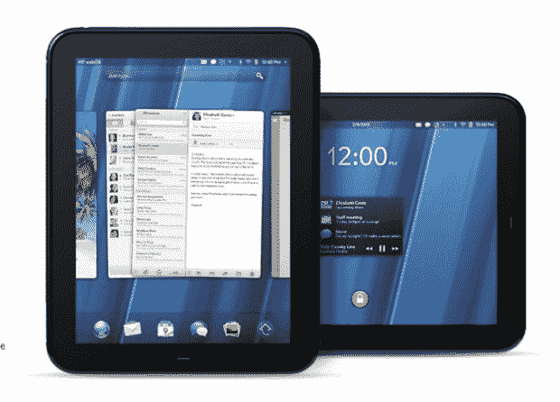
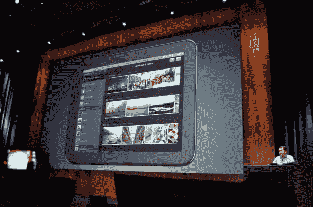
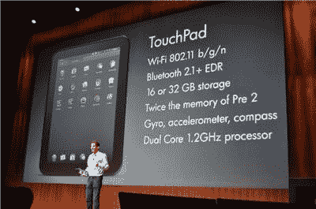
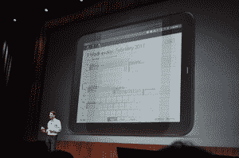

# 惠普发布 TouchPad 

> 原文：<https://web.archive.org/web/https://techcrunch.com/2011/02/09/hp-announces-the-palm-touchpad/>

# 惠普发布触摸板

这是正式的。Palm 的新 WebOS 设备叫做 Touchpad。它有 9.7 英寸的屏幕，前置 130 万像素的摄像头，有 16 或 32GB 的型号。它运行 1.2GHz 骁龙处理器，屏幕分辨率为 1024×768。

由 WebOS 团队的“数百名天才程序员”设计的 TouchPad 是惠普新十年的第二款 [slate](https://web.archive.org/web/20221204233036/http://crunchgear.com/tag/hp-slate) ，第一款是[惠普 Slate 500](https://web.archive.org/web/20221204233036/http://www.crunchgear.com/2010/10/22/hands-on-video-with-the-hp-slate-500/) 。

更新–触摸板的[产品页面现已上线。](https://web.archive.org/web/20221204233036/http://www.palm.com/us/products/pads/touchpad/index.html) 

 
这款触摸板是 Palm CEO 乔恩·鲁宾斯坦的宝贝。WebOS 在 9 个月前被出售时遭遇了严重的低迷，Palm 团队投入的所有努力似乎都化为乌有。然而，触摸板为 Palm 指出了一个新的方向，WebOS 独特的“卡片”界面似乎非常适合平板电脑。

该设备支持多任务处理和闪存。它配有 Quickoffice，支持谷歌文档、Dropbox 和 Box.net 的云文件存储以及惠普无线打印机支持。它还使用 Skype 进行视频通话。

简要规格列表:

*   双核 1.2 Ghz 骁龙处理器
*   802.11 b/g/n，蓝牙 2.1 + EDR
*   陀螺仪/加速度计、指南针
*   9.7 英寸 1024×768 显示屏，130 万像素网络摄像头，支持视频通话
*   1.6 磅，13.7 毫米厚

注意，为了便于比较，它几乎和现在的 iPad 一样大。该设备运行所有标准的 WebOS PIM 应用程序，包括 Palm 的优秀邮件应用程序。它还支持开箱即用的 Flash，因此所有您喜欢的网站(使用 Flash)都可以无缝运行。

[产品页面](https://web.archive.org/web/20221204233036/http://www.palm.com/us/)