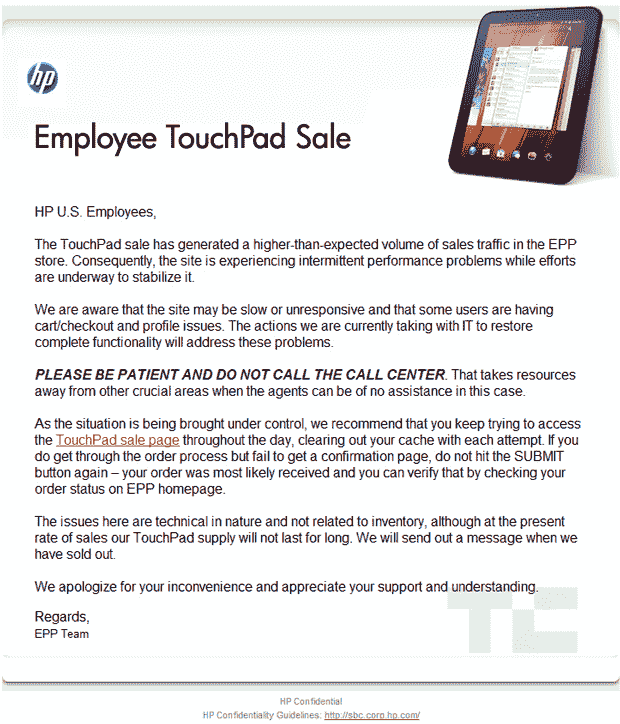

# 惠普内部 99 美元 TouchPad 销售比预期更受欢迎，击败网络服务器 TechCrunch

> 原文：<https://web.archive.org/web/https://techcrunch.com/2011/09/29/hps-internal-99-touchpad-sale-more-popular-than-expected-crushes-web-server/>

# 惠普内部 99 美元的 TouchPad 销售比预期更受欢迎，碾压网络服务器

人们喜欢 99 美元的 TouchPad，包括惠普员工。TouchPad 昨天打击了惠普的员工购买计划，潜在买家蜂拥而至，很快导致服务器崩溃。目前还不清楚卖出了多少触摸板，但我的惠普线人还没有买到便宜的触摸板。相反，他收到(并转发)了一封电子邮件，详细说明了问题，并警告员工不要用他们的痛苦来打扰呼叫中心。“我们的网站太慢了，”他说。惠普可能仍然为员工保留触摸板，因为他没有收到电子邮件说它们已经卖完了。

希望在惠普解决了员工问题后，该公司将向零售商发放最后一批触摸板。上个月第一批缺货后，在惠普宣布更多产品即将上市后，大多数商店开始排队等候。我的日常工作包括查看几家零售商的网站，希望我能发现一个活跃的“立即购买”链接——显然惠普 30 万员工中的很大一部分人现在都在做同样的事情。
T3