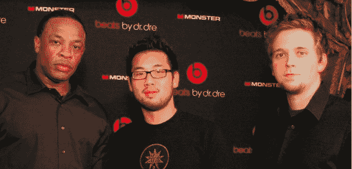

# HTC 的重大声明:HTC 将收购德瑞医生 Beats 的多数股权

> 原文：<https://web.archive.org/web/http://techcrunch.com/2011/08/10/htc-announcement/>

# 宏达电宣布:宏达电将由德瑞医生收购 Beats 的多数股权

凯特，见见包的外面。

你知道 HTC 安排在明天早上发布的[“重大声明”吗？这些细节只是提前透露了一点。](https://web.archive.org/web/20230227150112/https://techcrunch.com/2011/08/10/htc-to-make-major-announcement-tomorrow-morning/)

HTC 刚刚证实，他们将与 Beats Electronics 建立战略合作伙伴关系，Beats Electronics 是一家以其 Beats by 德瑞医生系列耳机而闻名的公司。虽然他们为明天的电话会议留下了*一些*细节，但预计 HTC 将宣布他们已经获得了该公司的多数股权(51%)。

投资的实际规模会因你的谈话对象而有所不同: [CNET](https://web.archive.org/web/20230227150112/http://news.cnet.com/8301-31001_3-20090967-261/htc-to-acquire-majority-stake-in-dr-dres-beats/) 称超过 5 亿美元，而 [AllThingsD](https://web.archive.org/web/20230227150112/http://allthingsd.com/20110810/seeking-street-cred-htc-investing-300-million-in-beats-electronics/) 称是 3 亿美元。(**更新:**现已确认 3 亿美元)

正如你可能预期的那样，HTC 将利用这笔投资将 Beats 技术(当然还有“Beats”品牌)融入他们的手机，首批 Beats 手机将于今年秋天上市。至少，这意味着一些人在乘坐公共交通工具时坚持从他们手机的蹩脚扬声器中播放的音乐在未来可能听起来不那么蹩脚了。

为了庆祝，这里有一张我年轻时的照片(还有 TechCrunch 校友彼得哈！)和一个完全兴奋的德瑞医生在一起:

我们仍在计划明天的活动，以防有任何有趣的细节被抛出。