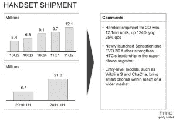

# HTC 报告在 Q2 创下利润记录，售出 1210 万部手机 TechCrunch

> 原文：<https://web.archive.org/web/http://techcrunch.com/2011/07/29/htc-reports-record-profits-in-q2-12-1-million-handsets-shipped/>

# HTC 报告在 Q2 创下利润记录，售出 1210 万部手机

看起来台湾的事情进展得很顺利，今天早上 HTC 报道了破纪录的 Q2 结果。事实上，该公司在第二季度售出了 1210 万台，同比增长率为 123.7%。扣除 Q2 税之后，这使得年增长率达到 102.9%。如果你不擅长计算百分比，那就太好了。就季度增长而言，HTC 比第一季度增长了 24.8%。

这其中很大一部分可以归功于中国，这是 HTC 的“突出”市场。Wildfire S、Salsa 和 ChaCha(又名美国电话电报公司的脸书地位手机)等入门级机型也通过扩大 HTC 的产品组合产生了影响。当然，感觉和 Evo 3D 当然也发挥了作用。

 我前面说过，HTC 公司势如破竹。不幸的是，[苹果](https://web.archive.org/web/20230203105237/https://techcrunch.com/tag/apple)想要成为公司成功道路上的一个巨大路障。苹果最近在请求美国国际贸易委员会禁止 HTC 产品进口后赢得了法官的支持。这肯定会伤害 HTC，尽管这家台湾公司在专利方面肯定会努力保护自己。

确切地说，它花了 3 亿美元收购 S3 图形公司，增加了 235 项专利(和专利申请)。但随着这场法律纠纷的推进，谁也不知道苹果是否会绊倒 HTC。

对下一季度的预估不会偏离该公司在 Q2 期间的增长太远。HTC 预计出货量为 1350 万部，同比增长 98%。如果一切按计划进行，仅下一季度就有 48 亿美元的净收入。