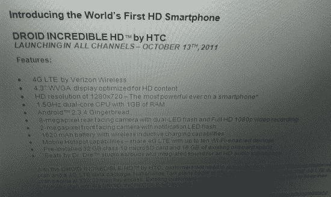

# HTC Vigor 更名为 Incredible HD，准备 10 月发布？TechCrunch

> 原文：<https://web.archive.org/web/http://techcrunch.com/2011/09/16/htc-vigor-renamed-incredible-hd-poised-for-october-release/>

# HTC Vigor 更名为 Incredible HD，准备 10 月发布？

当 HTC Vigor 的第一张照片开始流传时，我随口提到时髦的背板和红色装饰使它看起来像是威瑞森令人难以置信的系列中的新成员。事实证明，这种预感可能刚刚得到证实，因为最近泄露的消息表明，一种非常类似的设备称为不可思议的高清是[定于 10 月推出。](https://web.archive.org/web/20230203192528/http://www.droid-life.com/2011/09/15/htc-vigor-to-be-rebranded-as-the-droid-incredible-hd-launching-october-13/)

根据发布的细节，不可思议的 HD 是一款新的威瑞森 LTE 设备，配有 4.3 英寸屏幕，1.5 GHz 处理器，1 GB 内存，支持 Beats 音频。巧合的是，这些规格几乎完全符合那些泄露的原始活力图片。

该版本继续描绘了一幅令人印象深刻的活力/不可思议的高清画像:与 Runnymede 一样，据报道，它将配备一副 Beats 耳机，该设备将自带 48 GB 的超大存储空间(16 GB 板载，32 GB 预装在 microSD 卡中)。

尽管这张图片令人信服，但一些细节并不合理。该新闻稿将难以置信的高清列为具有 WVGA 显示器，其分辨率仅为 800×480——很难称之为高清质量。

更糟糕的是，规格清单自相矛盾:在称赞手机的 WVGA 屏幕之后，它提到难以置信的高清运动实际上是“1280×720 的高清分辨率”。虽然这可能是一个简单的打字错误(1280×720 偶尔被称为 WXGA，尽管通常不在电话的上下文中)，但也可能是一个新手伪造者混淆了他们的行话。

令人难以置信的高清，如果是真的，看起来会在 10 月 13 日出货时带来真正的冲击力。虽然这肯定会给假日季的智能手机大战增添趣味，但整个套餐看起来好得令人难以置信。

