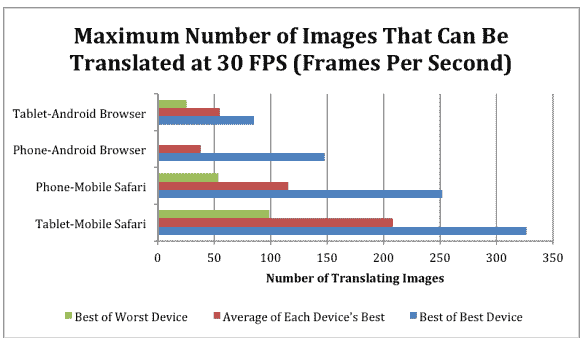

# HTML5 游戏性能:iOS 比 Android 快 3 倍；iPad 2 顶级设备 TechCrunch

> 原文：<https://web.archive.org/web/https://techcrunch.com/2012/03/05/html5-game-performance-survey/>

Android 可能是最受欢迎的移动浏览器，[今天超过了 Opera](https://web.archive.org/web/20221007213130/https://beta.techcrunch.com/2012/03/05/androids-now-on-top-for-mobile-browsing-and-search-but-still-a-challenger-elsewhere/) ，但当谈到 HTML5 性能时，看起来 iOS 才是王道。至少根据来自 [spaceport.io](https://web.archive.org/web/20221007213130/http://spaceport.io/) 的一份新报告，这份报告声称是“有史以来第一份关于该技术在顶级智能手机和平板电脑平台上的表现的报告”。

也是时候了。随着脸书和主要运营商和原始设备制造商的支持，HTML5 已经成为一种可行的技术，在当今许多最流行的平台上支持丰富的移动应用程序。有趣的是，许多人猜测 HTML5 可能会阻碍苹果成为主流移动平台的追求，但 spaceport 的“PerfMarks 报告”显示，在屏幕上呈现运动时，iOS 设备和浏览器(iPhone、iPad 和 Safari)全面超越其 Android 竞争对手。

Spaceport 希望加入 HTML5 联盟的运动，建立一系列客观的基准来判断 HTML5 游戏在移动操作系统上的性能，希望建立行业标准，并为开发者提供跨平台性能的可靠试金石。该公司通过分析图像移动能力来测试每款设备支持 HTML5 游戏的能力，首先也是最重要的是，以每秒 30 帧的速度测量屏幕上的移动图像数量——这一速度与原生体验相当。

Spaceport 发现，iPhone 4S 和 iPad 2 等 iOS 设备的得分非常高，分别处理了 200 多个移动物体和 300 多个移动物体。就这一点而言，iPad 2 在 HTML5 游戏和应用程序性能方面排名第一，全面击败了所有 Android 设备。

根据该报告，只有 Android Galaxy Nexus 能够在屏幕上保持一个以上的移动物体(平均约 100 张图像)，而所有其他 Android 手机，例如 Droid 2，都难以以每秒 30 帧的速度处理一张图像。对 Android 来说不幸的是，像 Droid 2 这样的手机甚至排在最古老的测试 iPhone 3GS 的后面，3GS 以 30 FPS 的速度处理 53 个移动物体。

更重要的是，尽管许多 Android 平板电脑运行着强大的硬件，但大多数表现不佳，尽管“Galaxy Tab 和华硕 Eee Pad Transformer 表现平平，但只是使用了某些动画技术，如 css3dbackground 和 css2dimg。”

总的来说，该报告得出结论，两个平台的最新版本 iOS 5.0 和 Android 4.0 都“取得了巨大的进步”，自上一版本以来，图像移动功能都增加了 100%。报告指出，Android 的光明面是，冰激凌三明治使其成为“HTML5 开发更可行的环境”，而 Android 3.0 设备呢？没有那么多。

“HTML5 随着时间的推移变得越来越快，这可以从 Android 和 iOS 的最新操作系统更新中看出。尽管这是一个受欢迎的趋势，但仍有很长的路要走，”spaceport.io 创始人本·萨维奇说。

更多信息，[请点击这里查看 spaceport.io 网站](https://web.archive.org/web/20221007213130/http://spaceport.io/),[请点击这里](https://web.archive.org/web/20221007213130/http://spaceport.io/spaceport_perfmarks_report_2012_3.pdf)查看托管报告。

