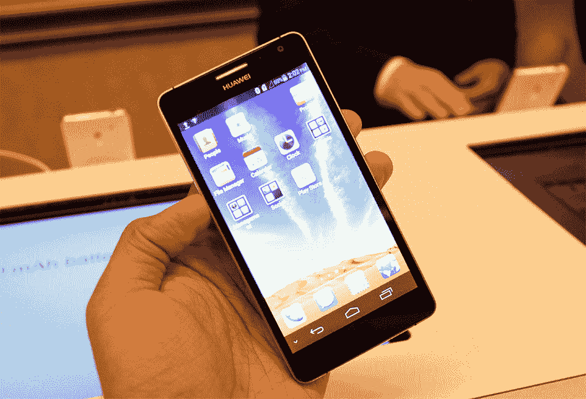

# 华为正式发布了 6.1 英寸的 Ascend Mate 和 5 英寸的 Ascend D2，我们动手吧 

> 原文：<https://web.archive.org/web/https://techcrunch.com/2013/01/07/huawei-officially-reveals-the-6-1-inch-ascend-mate-and-the-5-inch-ascend-d2-we-go-hands-on/>

# 华为正式展示了 6.1 英寸的 Ascend Mate 和 5 英寸的 Ascend D2，我们动手吧

LG 和美国电话电报公司的 CES 前会议都没有多少智能手机硬件可以炫耀，但华为在曼德勒湾会议中心的新闻发布会上改变了这一切。随着华为 Ascend Mate 和 Ascend D2 的正式发布，这家中国公司终于让数周的猜测(更不用说一系列泄露)告一段落——这是一对配备超大显示屏的安卓手机。

华为认为 Mate 是其最大的智能手机，D2 是其最强大的智能手机，但 Ascend Mate 显然是两者中更独特的一个，这在很大程度上要归功于它宽敞的 6.1 英寸 720p 显示屏(我口袋里的 Droid DNA 突然感觉如此不够用)。自然，华为的手机/平板电脑混合产品需要相当大的马力来推动所有这些像素，该公司依赖其海思半导体部门的 1.4GHz 四核芯片组。Mate 的引擎盖下还有 2GB 的内存，配备了可笑的 4，050mAh 电池，自带 8GB 的内部闪存，运行 Android Jelly Bean 4.1.2(由于华为定制的情感 UI，部分内容模糊不清。奇怪的是，早期的报道认为 Mate 拥有更高分辨率的 1080p 显示屏和更快的处理器——目前还没有关于这个特定版本有何不同的消息。

但是感觉如何？嗯，这并不奇怪，伴侣是少数，但令人惊讶的是，由于其纤细的腰围抓地力。也就是说，单手操作至少是冒险的，但如果你有足够大的手套，并启用类似于 Galaxy Note 上看到的那种单手用户界面，这并不是完全不可能的。说到手套，华为的神奇触摸屏技术也意味着 Mate 将接受戴手套的手的触摸输入，尽管我手头上没有任何手套来试用。抛开尺寸不谈，翻看这款设备在很大程度上是一种无缝体验——没有任何延迟或视觉上的口吃。

与此同时，Ascend D2 的 5 英寸 1080p 面板略显不够宽敞，但其规格表同样强劲。正如所料，D2 确实配备了类似的 1.5GHz 四核处理器(也来自海思)，1300 万像素的后置摄像头和 3000 毫安时的大电池。它比配偶的头发还粗，但它的防尘防水性弥补了这一点——从舞台上的水箱来看，我们很快就会看到一个演示。D2 的底盘可能自然比它的大哥薄一点，但它的圆形背部实际上使它成为一个非常舒适的悬挂设备。该公司对这个大的小东西非常自豪——他们只是说他们使用了“比 iPhone 更先进的制造技术。”鉴于它是华为最强大的手机，它在滚动到主屏幕和应用程序列表时没有显示任何延迟也就不足为奇了，尽管在这么短的时间内很难获得良好的性能。

华为一直在准备随时在美国引起轰动，但不幸的是，没有消息表明这两款手机是否或何时会正式进入这些地区。话说回来，华为最近已经开始通过亚马逊直接销售其部分硬件，因此华为有机会以某种方式将这些精彩的平板电脑带到美国。