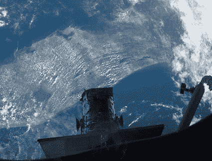

# 哈勃修复完成，该回家了 

> 原文：<https://web.archive.org/web/https://techcrunch.com/2009/05/19/hubble-repairs-are-complete-time-to-come-home/>

# 哈勃修复完成，该回家了

[哈勃望远镜](https://web.archive.org/web/20221006084804/http://www.crunchgear.com/tag/hubble/)一切顺利。亚特兰蒂斯号机组人员完成了细致的维修，并将卫星释放回太空。

现在，大概在小睡一会儿，甚至可能在[看完《星际迷航》之后](https://web.archive.org/web/20221006084804/http://www.crunchgear.com/2009/05/16/star-trek-was-screened-on-the-iss/)，机组人员必须检查航天飞机机翼、机头罩和底部瓷砖的热防护。航天飞机在发射过程中受到损坏，这些瓦片是飞船上的灵魂和重返大气层的热量之间唯一的东西。我们向他们致以最良好的祝愿。