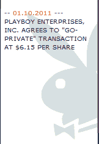

# 休·海夫纳将花花公子企业私有化(每股 6.15 美元)

> 原文：<https://web.archive.org/web/http://techcrunch.com/2011/01/10/hugh-hefner-takes-playboy-enterprises-private-at-6-15-per-share/>

# 休·海夫纳将花花公子企业私有化(每股 6.15 美元)

[全球知名的成人娱乐和媒体公司](https://web.archive.org/web/20230202230431/http://www.playboyenterprises.com/)花花公子企业[将再次“私有化”](https://web.archive.org/web/20230202230431/http://www.prnewswire.com/news-releases/playboy-enterprises-inc-agrees-to-go-private-transaction-at-615-per-share-113193909.html)。

这家媒体公司当然出版《花花公子》杂志，但也经营名为[花花公子在线](https://web.archive.org/web/20230202230431/http://en.wikipedia.org/wiki/Playboy_Online)的互联网业务部门，以及电视和广播网络，将被 Icon 收购控股公司以每股 6.15 美元的价格私有化。

后者是由标志性的花花公子企业创始人休·海夫纳(他也刚刚订婚)控制的有限合伙企业，万岁！).《花花公子》最初于 1971 年上市。

6.15 美元的价格比 1 月 7 日星期五的收盘价溢价 18.3%，比 2010 年 7 月 9 日的收盘价溢价 56.1%，7 月 9 日是该提议首次公布前的最后一个交易日。

Icon Acquisition Holdings 已从 Rizvi Traverse Management 的一家关联公司获得交易的股权承诺，并从 Jefferies & Company 的关联公司获得交易的债务承诺。

《花花公子》首席执行官斯科特·弗兰德斯(Scott Flanders)将继续留在公司，担任目前的职位，并保持对《花花公子》的大量股权投资。他表示，战略是将苦苦挣扎的《花花公子》转型为一家成熟的品牌管理公司:

> “这笔交易将通过加强我们的资产负债表和简化我们的运营来推进我们的努力，同时创造参与新企业的机会。我对未来感到兴奋，我期待着与我们的新伙伴合作，引领《花花公子》进入下一个时代。”

交易的更多细节可在[新闻稿](https://web.archive.org/web/20230202230431/http://www.prnewswire.com/news-releases/playboy-enterprises-inc-agrees-to-go-private-transaction-at-615-per-share-113193909.html)中获得。