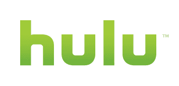
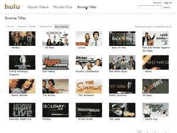
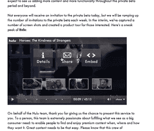
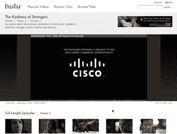

# Hulu 发布私人测试版，第一印象很好

> 原文：<https://web.archive.org/web/https://techcrunch.com/2007/10/28/hulu-launches-private-beta-first-impressions-very-good/>

去年 3 月，NBC Universal and News Corporation[宣布了](https://web.archive.org/web/20230225204156/https://techcrunch.com/2007/03/22/news-corp-nbc-may-announce-distributed-youtube-competitor-tomorrow/)一家合资企业，我们最初认为这将成为 [YouTube](https://web.archive.org/web/20230225204156/http://www.youtube.com/) 的直接竞争对手。随着[细节的出现](https://web.archive.org/web/20230225204156/https://techcrunch.com/2007/03/22/confirmed-tv-networks-launch-new-company-to-counter-perceived-googleyoutube-threat/)，很明显这两家媒体集团并没有计划为用户生成的内容建立一个视频分享网站，而是为包括电视节目、电影和短片在内的优质视频内容建立一个在线分销渠道。

在两家公司首次发布新闻稿后的几个月里，我们给合资公司带来了很多痛苦，因为[没有为项目选择一个名称](https://web.archive.org/web/20230225204156/https://techcrunch.com/2007/03/23/what-we-know-so-far-about-newtube-isnt-good/)，最终[确定了一个名称](https://web.archive.org/web/20230225204156/https://techcrunch.com/2007/08/29/hulu-translates-to-cease-and-desist-in-swahili-oh-the-irony/)–Hulu，在斯瓦希里语中是“停止”和“停止”的意思，抄袭谷歌的任务声明，并从 NBC Universal 自己的首席数字官那里得到了[不是最大的信任票](https://web.archive.org/web/20230225204156/https://techcrunch.com/2007/09/25/expect-failure-from-hulu-nbcu-chief/)。

在所有这些批评的背后，是对 NBC 和新闻集团能否在合资企业变得无关紧要之前让 Hulu 出局的高度怀疑。9 月份，NBC [甚至宣布了](https://web.archive.org/web/20230225204156/https://techcrunch.com/2007/09/19/is-hulu-doomed-nbc-to-begin-offering-free-downloads/)一项视频下载服务，该服务似乎正在蚕食其与新闻集团的合资公司。然而，上周 Hulu 证实，它确实会在 10 月 29 日(周一)推出私人测试版，从而赶上[自己设定的 10 月份最后期限](https://web.archive.org/web/20230225204156/https://techcrunch.com/2007/10/23/hulu-set-to-launch-on-monday/)。上周五，首席执行官杰森·基拉尔和其他 Hulu 代表向我们展示了这项新服务。

虽然我们还不能亲自测试私人测试版，但 Hulu 的界面预览和它的大部分功能给我留下了深刻的印象。然而，在我开始考虑这个网站之前，我应该先了解一些关于 Hulu 的细节，尤其是自从最初的声明发布以来已经过去了几个月。

Hulu 仍然是 NBC 环球和新闻集团的独家合资公司。它以一个网站的形式存在，用户可以通过这个网站免费点播一系列电视节目、电影和短片，对每个视频的观看次数没有任何限制。Hulu 也是几个合作网站的优质内容分发网络——AOL、MSN、MySpace、Comcast 和 Yahoo——这些网站将免费展示 Hulu 的视频，但使用自有品牌的播放器。除了这些合作关系，用户自己也形成了一个病毒式的分发网络，因为 Hulu 允许其视频嵌入任何网站，并通过电子邮件分享。Hulu 在所有情况下都从广告中赚钱，它在自己提供的视频中或视频周围展示广告。稍后我会更深入地讨论嵌入和广告的细节。

Hulu 没有的几样东西:像 YouTube 一样的用户生成内容的仓库，或者像 iTunes Store 一样的下载服务。Hulu 上的所有视频都是优质内容，用户没有任何上传功能。电视节目和电影只能通过 Hulu 或其合作伙伴的 Flash 播放器播放，而不能下载到你的桌面或便携式媒体播放器上。虽然 NBC 和新闻集团希望专注于优质内容是可以理解的，但遗憾的是我们(目前)还不能从 Hulu 下载视频(无论是广告支持的格式还是收费的)。也许这是未来要寻找的东西，尽管公司代表对他们是否有计划保持沉默。

至于 Hulu 上的内容，电视节目将来自福克斯和 NBC，以及超过 15 个有线频道，包括 Bravo，E！、FX、SciFi、Sundance 和 USA。电影将来自福克斯和环球，在本周五刚刚签署的协议之后，还将来自索尼和米高梅。Hulu 表示，它的许多短片将来自独立的内容提供商，它还与史密森尼和 WWE 等其他公司签署了许可协议。总的来说，Hulu 的收藏令人印象深刻，我们可以预计在未来几个月里它会增长更多。代表们说，他们将听取消费者的需求，以确定接下来增加哪些节目和电影。[点击此处](https://web.archive.org/web/20230225204156/https://techcrunch.com/wp-content/hulu_videos.html)查看目前 Hulu 收藏的完整视频列表。

【T2

在可用性方面，Hulu 作为一个网站还需要几个月才能向公众开放。然而，在接下来的一周，它的收藏将在合作伙伴的网站上推出，所以我们可以期待很快在 AOL、MSN、MySpace、Comcast 和 Yahoo 上看到 Hulu 的大部分内容，如果不是全部的话。特定的视频何时可以通过 Hulu 获得，以及我们可以期待它们在 Hulu 上停留多长时间，将因视频而异。然而，作为一般规则，电视节目在正常电视上首次亮相后，将在夏威夷时间午夜之前在 Hulu 上可用。作为另一个一般规则，Hulu 将继续分发电视节目，直到五周的新剧集过去，届时旧节目可能会从网站上消失。

这是 Hulu 最大的弱点。尽管如此，它仍未摆脱广播电视的节目思维。Hulu 仍然对网络观众强加了一个时间表，即使这个时间表有五周的弹性。但是在网络上，五个星期可能不够。预约电视在这样一种媒体中毫无意义，因为在这种媒体中，时间段被扔出窗外，可用的视频库存以百万计。Hulu 可能会限制其吸引力，因为它不会无限期地保留所有的视频(谁知道某个特定的视频剪辑什么时候会成为下一个热门病毒呢？).观察这一限制如何影响嵌入式电视节目也将是一件有趣的事情，因为时间太长了，嵌入式电视节目可能会停止运行。同样，电影和短片将以不公开(或不确定)的方式在网站上添加或删除，尽管 Hulu 代表表示他们会尝试添加有需求的电影。Hulu 不仅会有新的版本，也会有老电影，而且只有十部电影可以开始。

现在谈谈 Hulu.com 本身的设计和特色。首先，这种体验完全是基于浏览器的，所以除了你可能已经安装的 Flash player 之外，没有其他软件需要安装。Hulu 在保持用户界面简单和突出网站实际内容方面做得很好。主页突出显示给定的视频，并列出最受欢迎的剧集、最受欢迎的剪辑和最近添加的视频。你也可以从主页搜索 Hulu 的全部收藏。该网站的其他部分列出了特定节目的可用剧集，并允许您按网络/工作室、字母顺序或受欢迎程度浏览视频。在您的用户资料页面上，您可以创建视频播放列表并查看您的观看历史。你的观看历史和播放列表都可以通过 RSS 共享，除了你可以在视频页面底部留下的用户评论，这在很大程度上形成了 Hulu.com 的社交功能。

视频本身以 480kbps 或 700kbps 的速度传输，这取决于您的带宽。Hulu 正在与 Adobe 合作，在今年年底前通过 Flash Player 9.2 提供更高的分辨率。Hulu 的视频播放器展示了我们目前在可嵌入播放器中看到的所有基本功能:通过电子邮件共享、通过 HTML 嵌入、视频细节、全屏、搜索和音量。它还有一些按钮，用户可以通过这些按钮直接向 Hulu 提交反馈，将视频弹出到自己的窗口，将页面的其余部分变暗以获得更好的观看效果，并对视频进行向上或向下投票。也许这款播放器最酷的功能是只选择一段视频与朋友分享或嵌入你的网站。嵌入式视频的功能较少，但用户仍然可以共享和嵌入已经嵌入的视频，这将真正有助于虚拟传播 Hulu 的视频(并降低在 YouTube 上嵌入低质量版本的流行程度)。但是，同样，如果嵌入的视频过期或者被嵌入者没有选择的新内容替换，这可能会在 Hulu 上适得其反。

最后，一些关于 Hulu 计划如何做广告的重要信息。虽然如果不亲自尝试 Hulu，我们无法确定广告对用户体验的影响，但 Hulu 的代表表示，广告的侵入性会比真正的电视节目小得多。广告将通过多种方式提供:与视频一起显示的横幅、覆盖视频底部的文本简介以及在视频之前、之中和之后播放的视频内剪辑。较短的视频会有叠加和横幅广告，而较长的视频会播放视频广告。Hulu 表示，对于较长的视频，广告的总播放时间将大幅降低，可能只占你在电视上看广告时间的 25%。因此，每 30 分钟的视频，您可能只看到 2 分钟的广告，而在电视上，您会看到 8 分钟。如果这是真的，那么 Hulu 肯定会比电视更方便消费者。然而，这可能仍然比人们在网上看视频时习惯的商业广告要多..当我们自己播放一些节目和电影时，我们将不得不看看广告实际上有多侵扰。无论是否在 Hulu.com 播放，广告都将出现在 Hulu 的视频中，Hulu 将控制所有的广告，与其合作网站分享收入。

下面是 Hulu 的一些附加截图。请记住，我们在 Webex 会话中捕获了这些，因此渲染质量相对较差。

**更新:** Hulu 视频[已经在至少一个合作网站 AOL](https://web.archive.org/web/20230225204156/https://techcrunch.com/2007/10/28/hulu-videos-already-available-on-aol/)上可用。[点击这里查看](https://web.archive.org/web/20230225204156/http://video.aol.com/video-category/hulu/110500)然而，如果你住在美国以外，你可能就没那么幸运了。生活在澳大利亚的邓肯试图在美国在线上观看 Hulu 视频时，看到了这条错误信息。