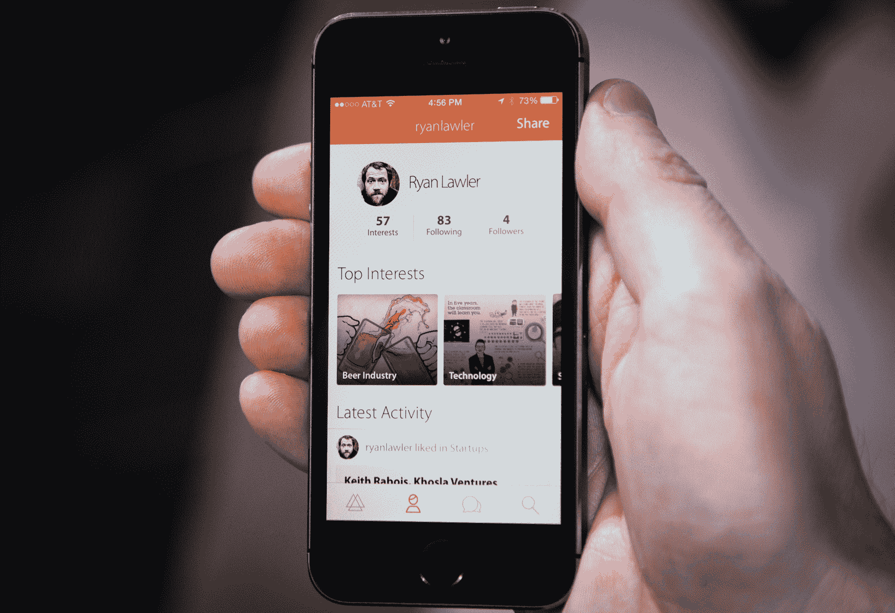

# 棱镜网英文版更新了它的新闻发现应用程序，为你带来你感兴趣的最好的东西 

> 原文：<https://web.archive.org/web/https://techcrunch.com/2013/12/19/i-am-large-i-contain-multitudes/>

很少有真正伟大的新闻探索应用，但是 prism 希望成为其中之一。为了成为找到你可能感兴趣的东西的首选服务，这家初创公司刚刚推出了一个新版本或其 iOS 应用程序，该应用程序充分利用了其推荐系统，并将其与更好的入职流程和参与工具相结合。

自从大约一年半前发布以来，我们已经写了相当多关于 prism 的文章，这使得[在](https://web.archive.org/web/20221007223627/https://beta.techcrunch.com/2012/05/16/prismatic-user-profiles/)[于今年夏天晚些时候发布移动应用](https://web.archive.org/web/20221007223627/https://beta.techcrunch.com/2012/08/23/prismatic-iphone/)之前，做出了一个不寻常的决定，要以网络为先。一年前，Prismatic】从吉姆·布雷耶和尤里·米尔纳筹集了 1500 万美元，深入挖掘，开发出适合大众的推荐引擎。

“作为一家公司，棱镜网英文版旨在让生活更有趣，”棱镜网英文版联合创始人布拉德福德·克罗斯说。“我们第一个产品的目标是成为你所有兴趣的家。在这里，你感兴趣的一切都可以被关注。”

现在的问题是，大多数基于兴趣的推荐模型都是孤立的，因此，并没有真正发挥作用。举例来说，我的 Twitter 上充斥着技术人员，他们一直在谈论技术新闻，如果我只关心技术，那就太好了。

但是我很大，我容纳了很多人，也许时不时地我想出去学习啤酒。或者阅读我最喜欢的运动队。或者找到有趣的新餐馆或异国情调的旅游地点添加到我的遗愿清单。没有真正好的方法在一个地方追求所有这些兴趣。

如今，大多数系统都很糟糕。内容要么是基于我自己选择的兴趣来找我的，这对于发现任何新东西来说真的不是很好，要么是因为我的一些朋友分享了它而被推荐的，这是判断它是否对我感兴趣的一种糟糕的方式。

正如我的老板(也是导师)亚历克西亚在一年前报道 prism 的融资时所写的那样，好的内容聚合和推荐服务就像一场好的派对:

> 如果你到了，你已经认识了所有人，事情很快就会变得很无聊；但如果谁都不认识，没有切入点，那还有什么动力留下来？

这(无可否认地)是描述 prism 希望解决的问题的长篇大论的前驱。问题是，它真的成功了吗？

有了最新版本的应用程序，我想是的。

prism 在这方面的成功部分来自于有很多好的内容和兴趣可以选择。prism 每天带来超过 500 万个故事，并有超过 10，000 个您可以关注的兴趣。

但坦率地说，这还不够好。在内容推荐中，你真正需要的是一个应用程序或服务，它能让你感兴趣但可能还没看过的东西浮出水面。在有限的测试中，这款应用确实在这方面表现出色。

通常情况下，当你进入一个新闻聚合器或其他推荐服务，并在其中添加兴趣或反馈，或者关注一群人时，你会收到一堆不相关的内容，通常只是最近或最热门的文章。(你可能认为自己对编织感兴趣，但你准备好被最有影响力的编织者最近投票选出的 20 篇关于编织文化的文章击倒了吗？)

棱镜就不是这样了。

克罗斯告诉我说:“棱镜很聪明，所以你可以跟随很多狗屎，但它不会压倒你。”。

更重要的是，它是“聪明的”,因为它不会因为用户对某一类型的文章竖起大拇指或发表评论，就把他们限制在某一类型的文章中。克罗斯指出，一些推荐算法变得过于迎合特定的兴趣，然后不再向用户介绍任何新的东西。棱镜网英文版努力时不时地突出那些其他偶然的兴趣，即使你表达了偏爱或分享一两个话题的新闻的强烈倾向。

这些都是 prism 以前做过的事情，但是有什么新的和不同的呢？

一方面，该应用程序的登录流程更快，这应该有助于人们更无缝地识别人和兴趣。在这次更新之前，this 的最大问题主要是获取足够的数据来提出建议。

“很多人并不真正理解它，但那些理解的人贪婪地使用它，”克罗斯说。让用户在第一天做出承诺很难，但如果他们这样做了，大多数人会发现应用程序的很多价值，并成为定期用户。每周有四分之一的用户会在一周的六七天中再次使用该应用，平均观看时长约为 11 分钟。

prism 做的另一件事是试图鼓励互动和内容共享，让人们参与进来。为此，它支持轻松评论，并在其他人评论或分享您评论的文章时提供通知。还有 Twitter 和脸书共享，这有助于把棱镜网英文版之外的人带进来。

“我们的目标是让讨论继续下去，”克罗斯说。

但最重要的是，它很漂亮，很有趣，使用起来很愉快。坦白地说，我以前并不是一个棱柱用户，但是以后只要我有几分钟空闲时间，想研究更多的技术和其他东西，我就会更多地使用它。