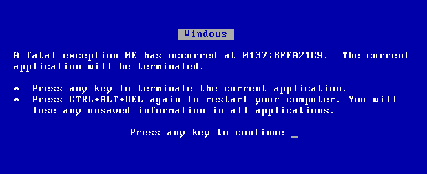
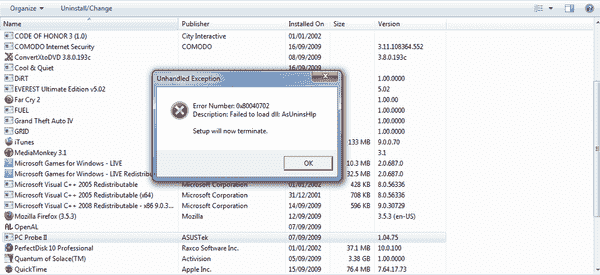
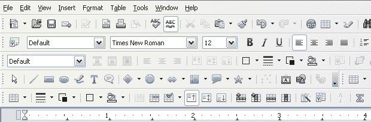
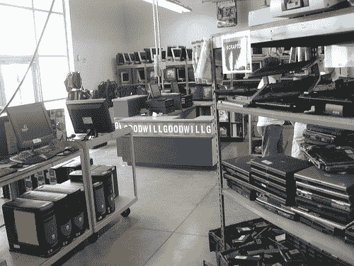

# 我讨厌电脑:一个系统管理员的自白

> 原文：<https://web.archive.org/web/https://techcrunch.com/2010/04/22/i-hate-computers-confessions-of-a-sysadmin/>

我经常想，如果管道工在他们的职业生涯中，在清理了一条又一条堵塞的下水道后，他们开始讨厌管道工作。他们讨厌管道。他们讨厌水管工的油灰。他们讨厌这些年来学到的所有技巧，他们讨厌必须学习技巧的需要。看在上帝的份上，这是管道工程:管道连接在一起，物质在其中流动。能有多复杂？

我讨厌电脑。不，真的，我讨厌他们。我喜欢它们带来的交流，我喜欢它们给我的生活带来的便利，我喜欢它们有时带给我的逃避；但实际上我讨厌电脑本身。计算机是脆弱、不直观的东西——脆弱的硬件和不透明、限制性软件的大杂烩。为什么？
 我每天给“用户”提供全天的电脑支持。我不是那些对不知道 IRQ 是什么的人嗤之以鼻的 IT 人。我认识到用户不关心电脑。对他们来说，计算机是达到目的的一种手段:一个请求更多资助的演示，或者一个研究新计算方法的程序，或者仅仅是给他们的家人发一封友好的短信。与其说他们想“使用计算机”,不如说他们想做一些计算机本身方便的事情。我对汽车也是一样:我不想知道内燃机是如何工作的，也不想知道如何更换我的机油，或者以任何其他方式成为汽车专家——我只想开车去杂货店！

但是该死的电脑妨碍了电脑帮助我们做的所有事情。关于管理员帐户、安全、权限和所有其他人们不关心的事情，有一整套人为的范例。仅仅为了保持你的计算机运行，就需要大量的辅助软件，但是这些软件带来了更多的复杂性和更多的故障点，并且最终导致了和它想要解决的一样多的灾难。

电脑错误信息毫无价值。

引发当前这轮愤怒的是一名用户无法检查 Windows 更新。Windows Update，这个程序，启动得很好。但是点击“检查更新”会导致一个无用的消息，即 Windows Update 无法检查更新。一个无意义的错误代码呈现给用户，好像他知道该怎么做。甚至还有一个有用的链接，上面写着“了解更多有关常见 Windows Update 问题的信息”。建议的问题列表包括各种其他无意义的错误代码，但不是该用户收到的那个。我知道如何访问 Windows 事件日志，但用户不知道，它不包含任何有指导意义的内容。对于一个普通用户来说，这将是一个死胡同，只有两个选择:忽略这个问题，希望不会发生任何不好的后果；或者尝试用电脑厂商提供的某种半生不熟的恢复方法或者 Windows 安装盘(假设他们有)来修复操作系统。

我支持的另一个用户在使用 Adobe Acrobat 时遇到了麻烦。试图从他的浏览器中打开 pdf 文件，结果失败得很惨。要么是链接根本打不开，要么是打开一个完全空白的页面，要么是 Internet Explorer 显示一个错误页面，提示存在网络问题！用户可以右键单击并“另存为”链接来获得 pdf，我很感激这个用户知道如何右键单击，这样他就有了一个可行的解决问题的方法，直到我找到根本原因。但是很多很多用户不知道鼠标右键是干什么用的。

我对微软百般挑剔，因为我认为他们做的很多事情根本就是错误的。但是许多其他公司也同样犯有糟糕的设计、糟糕的实施以及与用户沟通不畅的错误。谷歌的 Chrome 浏览器说“Aw snap！”，但这在无用性方面倾向于另一种方式:它没有给用户任何更好的想法，可能是错误的，用户会感到无助、无力和愚蠢。

即使事情进展顺利，用户也会感到无能为力和愚蠢。在基于 Windows 的系统上安装几乎任何程序都需要大量的点击，所有的点击都只是说“好的”“好的”“好的”。没有人阅读点进式 EULAs，没有人更改默认安装位置，也没有人选择特定的安装选项。他们只是不停地点击“好的”,因为这是他们被训练的目的。然后，他们最终在浏览器中增加了四个额外的工具栏和一堆“助手”程序，这些程序实际上对用户没有任何帮助，也不是用户真正想要的。他们不知道如何摆脱它们。

电脑没有意义。
 
关于在 Mac 或 Linux 上安装软件的简单性和有用性，有很多可以说的。在后一种情况下，您只需将文件拖到您的应用程序文件夹中，就大功告成了。Linux 包管理器在没有任何用户干预的情况下完成所有繁重的工作。如果一个 Linux 程序需要额外的库，包管理器会自动找到并安装它们。在这两种情况下，我可以用在 Windows 上安装程序的一小部分时间来安装新程序。

移除软件是令用户恐慌的另一个原因。再说一次，Mac 和 Linux 在大多数情况下让它变得相当容易。见鬼，在任何 Linux 系统上，我都可以用软件包管理器的一个命令(或者使用软件包管理器的 GUI 点击适当的按钮)在几秒钟内枚举所有安装的软件包。但是在任何一台 Windows 机器上——即使是一台拥有顶级硬件的全新机器——都需要很长时间来枚举和显示安装的软件；更糟糕的是,“添加和删除软件”控制面板项实际上并不会显示所有已安装的应用程序。移除任何特定的软件并不总是干净的操作:cruft 被留在文件系统和注册表中(甚至不要让我开始对 Windows 注册表的厌恶！).

说到文件系统，为什么一个 SQL 数据库可以在几分之一秒内找到一个有数百万条记录的数据库中的特定记录，而在你的硬盘上找到一个特定的文件却需要几分钟？我确信文件系统对用户如此不友好是有一些非常真实的原因的，但是如果我能向我的任何一个用户解释这一点，那就太糟糕了。

电脑太复杂，无法使用。

普通人可能会上一堂“计算机课”，指导他们完成一些特定的任务——通常是特定的应用程序(如何使用 Microsoft Word)，而不是特定的任务(如何使用文字处理程序)——但当体验与课堂上呈现的不同时，用户并没有做好处理这种情况的准备。如何解释这个新的错误信息？如何处理重复出现的应用程序故障？

计算机行业的变化速度对用户不利。整个彩色编码端口计划是为最终用户提供便利的重要一步，但当用户现在需要知道 VGA、DVI 和 DisplayPort 之间的区别时，这还不够。我办公室里的很多电脑都有三个视频端口，显示器支持多输入，这让用户不知道在设置电脑时应该使用哪一个。我已经接到很多来自非常聪明的研究生的电话，他们不知道如何将电脑连接到显示器上。当然，取笑这些情况很容易，但如果你问我，这是对整个计算机行业的谴责。

像尼古拉斯一样，[我从未在我拥有的任何一台电脑上感染过恶意软件](https://web.archive.org/web/20221007163546/http://www.crunchgear.com/2010/04/20/symantec-51-percent-of-all-malware-ever-was-detected-in-2009/)；但是我已经帮助很多人——我专业支持的用户以及家人和朋友——从恶意软件感染中恢复过来。你能想象你的丈母娘能够找到并遵循[这些指令](https://web.archive.org/web/20221007163546/http://www.bleepingcomputer.com/virus-removal/remove-internet-security-2010)来删除恶意软件吗？或者更糟，从你的反病毒软件中知道并响应一个[拙劣的反病毒更新](https://web.archive.org/web/20221007163546/https://kc.mcafee.com/corporate/index?page=content&id=KB68780)？

电脑带走了我们所有的数据，出现了惊人的故障。

硬件和软件公司都知道我们用电脑存储对我们来说很重要的信息。然而，备份数据以保证其安全仍然是一件非常棘手的事情。许多“企业”备份软件试图保护我们免受计算机故障(硬件、软件和用户错误)的影响，许多“消费者”解决方案争夺我们的消费者资金；但坦白说他们都很烂。为什么我们需要第三方软件来保护我们在计算机上的投资？用户不会购买备份软件，因为他们不希望自己的电脑出现故障。

如今，积累大量数据非常容易，如[数码照片档案](https://web.archive.org/web/20221007163546/http://journal.nearbennett.com/2010/02/05/how-do-you-manage-your-photos/)、MP3 收藏和视频，可靠地备份这些数据是一件非常痛苦的事情。不仅痛苦，而且昂贵。你花了几百美元买了一个漂亮的新相机，你还需要再花几百美元买一个外置硬盘，你可以把你所有的照片复制到上面保存。然后，当然，它需要*很长时间*才能真正地将你的数据从你的计算机复制到你的外部硬盘驱动器，而你只是没有时间或耐心来定期提交，所以你开始忽视它，然后 ***bam*** 你的计算机爆炸了——硬盘故障，恶意软件感染，等等——你丢失了价值数周或数月的不可替代的数据。

当然，一些计算机带有冗余磁盘，但大多数消费级 RAID 是硬件和软件的脆弱组合，进一步使设置复杂化。为什么可靠、低成本的 RAID 解决方案还没有成为主流？为什么终端用户还不能更好地访问有用的东西，比如快照，或者 ZFS？

对于最终用户不可能开始检测或诊断的所有小故障，如主板上凸出的电容器、有故障的显卡或不稳定的 RAM，又该如何处理呢？

电脑势不可挡。
 
现在在任何零售商店都可以买到的令人麻木的电脑数量*足以让最坚定的便宜货购物者感到害怕。面对一排又一排毫无意义的统计数字，一个外行人该如何着手？额外的 0.2 GHz 会对他们使用电脑产生明显的影响吗？这会让他们多活六个月，甚至一年吗？为什么一个普通用户会关心他们操作系统的位数呢？*

 *笔记本电脑猎人试图帮助人们找到合适的笔记本电脑，但是希拉的 2000 美元的 HP 并不一定是最好的选择，不是吗？当然， [AMD 正在简化其品牌](https://web.archive.org/web/20221007163546/http://www.crunchgear.com/2009/09/10/amd-simplifies-its-brand-again-with-vision/)。但这真的足以帮助人们找到满足他们需求的最佳产品吗？当大盒子零售电脑商店的货架上仍然有五个或十个看似相同的系统时，他们的品牌更新会有任何影响吗？

我讨厌电脑。

我知道我在这里的小咆哮就像对着风暴大喊:有一个庞大的、无精打采的行业在计算机时代的复杂性上赚取大量现金，而没有什么资本主义的动机来改变现状。这些抱怨并不新鲜。其中许多是在过去的四分之一世纪里制作的。我们试图以自己的方式，强调我们在整个行业中发现的一些不足，但这也是我们目前能做的。对于这些问题，你在做什么？

也许我会成为一名水管工…*