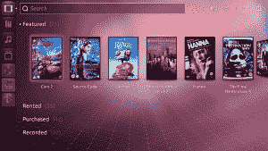
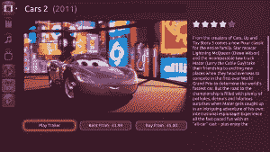

# 我要我的 Ubuntu 电视！

> 原文：<https://web.archive.org/web/https://techcrunch.com/2012/01/09/i-want-my-ubuntu-tv/>

CES 就要来了，毫无疑问，它充满了消费电子 OEM、ODM 等常见的可疑产品。今年一个有趣的新参与者是 [Canonical](https://web.archive.org/web/20230209125121/http://www.canonical.com/) ，他们是 [Ubuntu](https://web.archive.org/web/20230209125121/https://techcrunch.com/tag/ubuntu) GNU/Linux 发行版的幕后推手。Canonical 正在大力推动 Ubuntu 不仅仅在台式机和笔记本电脑上使用，并一直忙于与消费电子公司建立关系，以将其应用于平板电脑、手机和汽车车载信息娱乐显示器。我们将会看到 Ubuntu 在几个展台上展示这个作品。Canonical 还将发布 Ubuntu TV。

平板电脑、手机、IVI 系统和 Ubuntu 电视与 Ubuntu 作为易于使用的 Linux 桌面的卑微出身相去甚远。“人类的 Linux”一直是 Ubuntu 的口号，而不是“人类的便携式电子设备的 Linux”。因此，如果有人问“搞什么鬼，典范？”我向 Canonical 的首席执行官 Jane Silber 提出了一个稍微礼貌一点的问题。

据她说，CES 2012 将是 Ubuntu 在一系列消费设备上扩张的第一瞥。Canonical 有一个广泛的多屏战略，迄今为止他们在 Unity 界面上的大部分工作已经为该战略奠定了基础。此外，在 Unity 上的工作只是 Canonical 努力超越成为一个功能性桌面 Linux 体验的组件集成者的一个例子。他们的软件中心是另一个例子，作为对应用程序开发者的奖励。他们一直在与原始设备制造商合作，协助产品开发。还有他们的云存储和同步服务 UbuntuOne。Canonical 一直在努力开发 Linux 世界中的触摸界面支持，以及推动更好的 ARM 支持。

Ubuntu TV 将成为这一新战略的第一个证据。西尔伯说，你将能够观看自己的媒体文件、流媒体或广播媒体。目标是在不从根本上改变用户行为的情况下，将所有这些媒体来源结合起来。具体来说，Ubuntu TV 不仅仅是电视上的 Linux 桌面。西尔伯说，Canonical 不相信“电视上的浏览器”体验。“浏览器属于第二设备——平板电脑、手机等，”西尔伯告诉我。

在 Ubuntu 的标语上，Silber 声称 Ubuntu TV 是“人类的电视”。就是管用。”正如你从图片中看到的，Ubuntu TV 将有一个与当前 Ubuntu 桌面相似的界面，启动器在侧面，但会有根本性的差异。我们的目标是让 Ubuntu TV 成为“你的电视操作系统”，而不一定是机顶盒。在这方面，Canonical 正在与硬件合作伙伴合作执行 Ubuntu TV。在这一点上应该很清楚，虽然 Canonical 在这方面取得了很大进展，但 Ubuntu TV it 还不是一个成品。他们将在 CES 上演示工作代码，但我们暂时还不应该期待工作硬件。

我向 Silber 指出，有一大群人对 Unity 界面不屑一顾，并询问出于媒体消费的目的扩展它是否真的是一个好主意。像 Canonical 的大多数人一样，Silber 仍然坚信他们的用户测试证明了 Unity 的优点。“根据我们的行动，也根据我们的结果来评判我们，”她说。你可能还记得，Unity 的第一个 Ubuntu 版本也是 T4 最快采用的 Ubuntu 版本。

Ubuntu TV 将会开源，我们应该期待 Canonical 的应用开发框架。我向西尔伯询问了关于数字限制管理(DRM)的情况，以及 Canonical 如何与内容制作商和发行商合作。我特别想知道 Canonical 在 Ubuntu TV 上播放的内容种类上是否有任何底线。她说他们正在努力减少数字版权管理的扩散，但是他们意识到他们已经迟到了，还有很多工作要做。西尔伯承认 Canonical 与[紫外线](https://web.archive.org/web/20230209125121/http://en.wikipedia.org/wiki/UltraViolet_(system))有关，并表示在编码和 DRM 方面“从我们的角度来看，它有助于简化事情”。

根据 Silber 的说法，Ubuntu TV 最大的障碍是打破所有内容制作者和版权持有者建立的围墙花园。每个工作室都希望你在他们的网站上观看他们的内容，他们的小工具和广告——所有这些都在他们的控制之下。Canonical 认为应该有一个单一的、优雅的界面来消费媒体，不管内容来源如何。Silber 认为 Canonical 和 Ubuntu 代表了一个合理的中间立场，是一个相对厂商中立的解决方案。Canonical 不从事媒体制作业务，也不从事硬件制造业务:他们只想成为你的电视的操作系统(目前)。

“合理的中间地带”的概念不仅仅局限于 Ubuntu TV。Silber 说，随着 Canonical 推动 Ubuntu 在更多设备上的应用，许多 CE 制造商正在寻找 iOS / Android 霸权的第三种选择。西尔伯再次承认，Canonical 在这场游戏中姗姗来迟，但这确实让他们从开拓者的错误中吸取了教训，并确定了服务不足的市场。设备制造商希望有一个创新平台，以苹果和谷歌不满意的方式支持售后服务收入。他们也越来越意识到升级对他们产品的成功寿命至关重要。根据 Silber 的说法，Canonical 是一个更小、更容易合作的合作伙伴，在发布重大更新方面有着成熟的节奏。

虽然 Ubuntu TV 仍然是一个发展中的产品，但这是 Canonical 的一个积极迹象。Silber 向我保证，我们将在今年期待更多的新闻，展示 Ubuntu 作为一个跨多种消费设备的平台的可行性。有了 UbuntuOne 作为连接 Ubuntu 驱动的设备的数据同步服务，我认为我们可以期待 Canonical 在 2012 年在融合用户体验方面的有趣事情。