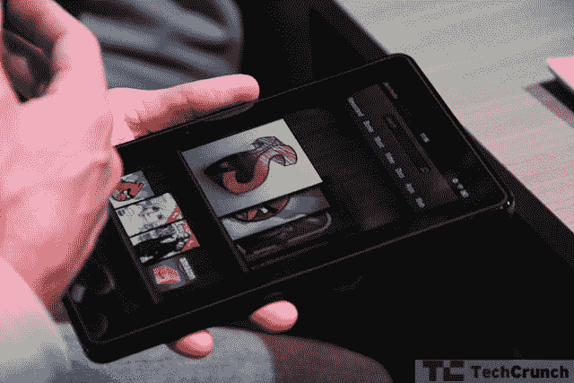
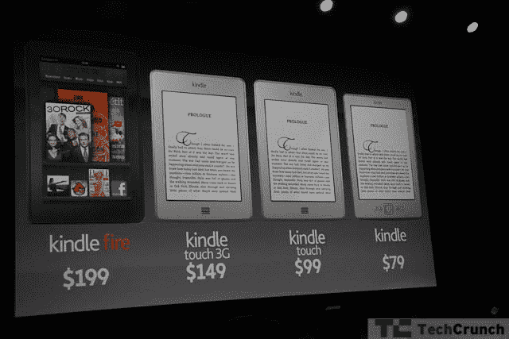

# 亚马逊刚刚凭借 199 美元的 Kindle Fire TechCrunch 赢得了安卓平板电脑大战

> 原文：<https://web.archive.org/web/https://techcrunch.com/2011/09/28/i-want-this-tablet/>

Android 平板电脑选举竞赛已经结束。德罗伊德维尔有了新市长。但这家伙并没有大张旗鼓地进城。他漫步在大街上，给出了比任何其他候选人都要多的价格，称赞一个基于务实的敏感性和可负担性的计划。遇见 Kindle Fire。

亚马逊刚刚发布了 Kindle Fire，毫无疑问，它将在未来几年统治 iPad 平板电脑市场。亚马逊复制了苹果的公式，这是正确的:平板电脑不按规格销售；亚马逊在声明中几乎没有提到 Fire 的硬件。相反，杰夫·贝索斯尽他最大的努力模仿史蒂夫·乔布斯，高高地站在台上，列举了一长串让 Fire 成为全世界想要的 iPad 替代品的功能。

Fire 运行安卓系统，但用户看不到。相反，亚马逊在一个未指明的 Android 版本上构建了一个自定义 UI。对于大多数消费者来说，这是正确的举措。Android 2.x 不适合平板电脑。当然，一些顽固分子喜欢平板电脑，但这些用户中的大多数会承认它不适合普通消费者。Honeycomb 也好不到哪里去，需要更强大的硬件——对于像亚马逊这样希望降低 iPad 价格的公司来说，这是一个障碍。然后你有亚马逊的巨大的服务器能力。

亚马逊正在利用它的许多服务器场进行预渲染，从而使整个网络浏览体验更加流畅。被称为亚马逊丝绸的浏览器学习用户的行为，并开始缓存经常访问的页面，以加快加载速度。该系统智能地将内容卸载到亚马逊的弹性计算云(Amazon EC2)，将其缩小到更易于管理的大小:Flash、图像和所有繁重的内容。所有这些都是在数据到达平板电脑之前完成的，这带来了丝滑的体验。经常访问 TechCrunch？很好，谢谢，但由于亚马逊丝绸的智能缓存，页面加载会更快。

当然，Fire 是一系列亚马逊服务的前端，但这种后端处理将使 199 美元的平板电脑在其价格点上没有任何其他东西。它加载页面的速度甚至可能比 A5 驱动的 iPad 2 还要快。

亚马逊 Fire 在某种意义上是 iPod Touch。当市场需要这种权宜之计的产品时，它正好击中了市场。iPad 显然是一个“更好”的设备，有更好的硬件和更多的功能，但 Fire 便宜 300 美元，仍然相当强大。同样，Fire 可能不是最好的 Android 平板电脑，但亚马逊显然用全新的界面弥补了硬件的不足。消费者对非 iPad 平板电脑表现出抵触情绪，但 500 美元的价格对许多消费者来说是可望而不可及的。一款 200 美元的平板电脑，装载了亚马逊的媒体产品，是将平板电脑从小众市场推向主流市场的正确产品。

亚马逊跟随苹果的脚步，在推出硬件之前推出了媒体服务。在过去的一年里，该公司在流媒体视频、MP3 下载和云计算方面投入了大量资金。现在一切都说得通了。通过向消费者展示，比如说，亚马逊 Prime 即时视频在用户的电脑上运行良好，他们现在更愿意购买基于这项服务的平板电脑。这个媒体内容瞬间把火推到了安卓线的前面。对于普通消费者来说，Fire 是完美的低价 iPad 替代品。