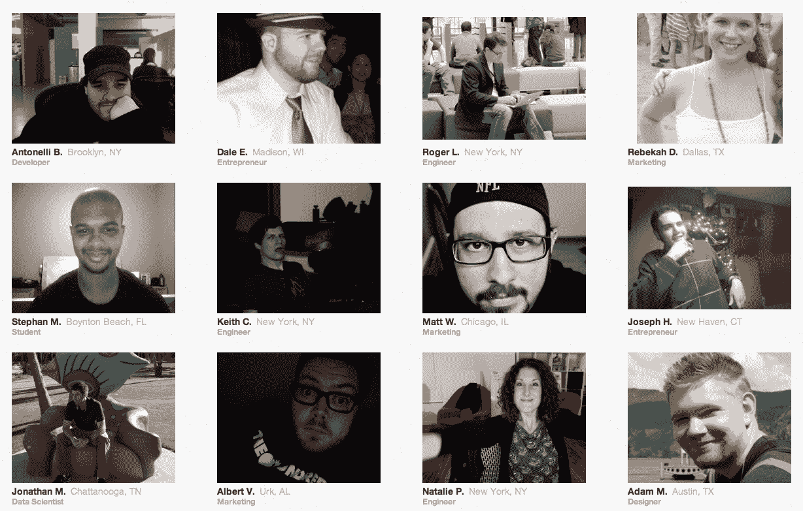

# “我为互联网工作”——向国会展示你对 SOPA 的真实感受

> 原文：<https://web.archive.org/web/https://techcrunch.com/2011/12/12/i-work-for-the-internet-tell-congress-how-you-really-feel-about-sopa/>

# “我为互联网工作”——向国会展示你对 SOPA 的真实感受

国会正在努力通过 SOPA 法案，即所谓的“停止网络盗版法案”,该法案包括各种严厉的措施来扼杀我们所知道的言论自由。这里有一个简单的行动，你可以告诉每个人你对此的感受。

一个名为“[我为互联网](https://web.archive.org/web/20230216034411/http://iworkfortheinternet.org/)工作”的网站让你上传照片和名字，以及你的职业。它展示了其他做过同样事情的人的照片。这很简单，也很温暖人心，也很好地提醒了政治家们他们应该真正站在哪一边。这个网站，显然是今天早些时候推出的，是由[为未来而战](https://web.archive.org/web/20230216034411/http://fightforthefuture.org/)创建的，这是一个[新的](https://web.archive.org/web/20230216034411/https://www.facebook.com/pages/Fight-For-The-Future/283481148338685?sk=info)倡导团体，是热门的“[自由比伯](https://web.archive.org/web/20230216034411/http://freebieber.org/)”网站的幕后推手。

你可能不会通过分享你的照片来改变任何投票，但如果你一直觉得该法案被错误地描述为“媒体公司对科技公司”，就像我一样，你会从参与中获得一些安慰。浏览这个网站也会给你一种发自内心的感觉，那就是所有那些随机的互联网用户都是谁。

SOPA 将于本周晚些时候举行众议院委员会投票，这个网站不会直接告诉他们你的感受。因此，如果你还没有联系你当地的代表，请务必联系他们(并在这份请愿书上签名)。你也可以点击查看我们之前对该法案的报道[。为了进一步阅读，请务必查看 TechDirt 上的几篇关于该法案的](https://web.archive.org/web/20230216034411/https://techcrunch.com/search/sopa)[最新糟糕修订](https://web.archive.org/web/20230216034411/http://www.techdirt.com/articles/20111212/14010917054/lamar-smith-proposes-new-version-sopa-with-just-few-changes.shtml)及其[更好的替代方案](https://web.archive.org/web/20230216034411/http://www.techdirt.com/articles/20111209/13013417024/good-bad-new-open-bill-wyden-issa.shtml)的精彩文章。

