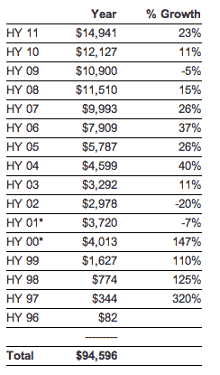

# IAB:2011 年上半年互联网广告达到创纪录的 150 亿美元；增长 23% 

> 原文：<https://web.archive.org/web/http://techcrunch.com/2011/09/28/iab-internet-advertising-reaches-a-record-15b-in-first-half-of-2011-up-23-percent/>

# IAB:2011 年上半年互联网广告达到创纪录的 150 亿美元；增长了 23%

互联网广告局[刚刚发布了 2011 年上半年的数据](https://web.archive.org/web/20230205032210/http://www.businesswire.com/news/home/20110928006009/en/Internet-Ad-Revenues-15-Billion-First-Half-2011)，看起来互联网广告收入在此期间创下了历史新高。2011 年上半年，互联网广告收入增长了 23.2%，达到创纪录的 149 亿美元。增长率比去年同期增长了一倍多，去年上半年的广告收入为 121 亿美元(比 2009 年增长了 11.3%)

仅第二季度的互联网广告收入也创下新高，增长 24.1%，达到 77 亿美元。这比 T2 Q2 2010 年 T3 的 62 亿美元有所增长，比 2009 年增长了 13.9%。2011 年上半年，展示广告总额超过 55 亿美元，比 2010 年同期增长 27.1%。

在 2011 年上半年，展示实际上占了所有互动支出的 37 %,搜索仍然是领先的在线类别，占总支出的 49 %(或近 73 亿美元)。搜索和显示业务均同比增长约 27%，其中搜索业务较上年 11.6%的增长率增长了一倍多。

数字视频广告也持续增长，同比增长 42.1%，2011 年上半年收入 8.91 亿美元，接近 10 亿美元大关。与 2010 年同期相比，潜在客户创造支出增长了 25.4%，但分类广告支出下降了 2%，电子邮件支出下降了 34.2%。

IAB 还研究了支持在线广告的特定收入模式的支出。例如，使用基于效果的模型的广告比使用基于印象的模型的广告增长更快，达到 96 亿美元。基于印象的广告支出确实增长了 10.8%，尽管定价模式仅占总广告的 31%，低于去年同期的 35%。

IAB 表示，广告收入的增长是营销人员在数字上投入更多赌注以“讲述他们的品牌故事”的结果。

