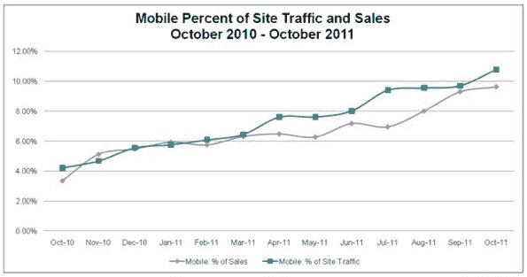

# IBM:移动零售流量将在这个假期翻一番以上 

> 原文：<https://web.archive.org/web/https://techcrunch.com/2011/11/04/ibm-mobile-retail-traffic-will-more-than-double-this-holiday-season/>

# IBM:移动零售流量将在这个假期增加一倍以上

IBM 的 Coremetrics 基准正在发布未来几个月的假日购物趋势数据。蓝色巨人表示，移动零售流量将在这个假期增加一倍以上。

IBM 表示，在今年 11 月的假日季节，预计将有 15%的美国人通过移动设备登录零售商的网站，这是前所未有的。11 月份的所有网上销售将比 2010 年同期增长 12-15%。

IBM 报告称，10 月份，近 11%的人使用移动设备登录零售商的网站，高于 2010 年 10 月份的 4.2%。此外，手机销售持续增长，从 2010 年 10 月的 3.4%增长到 2011 年 10 月的 9.6%。

预计将在安卓用户中出现的新趋势之一。越来越多的 Android 用户将首次表现出与 iPhone 用户相似的移动购物水平。这些 2011 年 10 月的数据显示，iPhone 占移动流量的 4%，Android 占 3.5%。iPad 也将在这个季节的假日购物中扮演重要角色。10 月，iPad 转换率达到 6.8%，而整体移动设备转换率为 3.6%。

IBM 还表示，移动购物者将在这一季表现出对购买的高度关注，超过其他在线购物者，移动设备上的跳出率为 44.2%，而在线购物率为 37.3%。

主要来自脸书的社会影响也将在这个假日季节的购买过程中发挥越来越大的作用。根据 10 月份的转化率，从社交媒体网站访问零售网站的消费者中有 9.2%进行了购买。相比之下，去年所有直接网上购物的比例为 5.5%。

所有迹象都表明，这个假期是手机购物的旺季。

