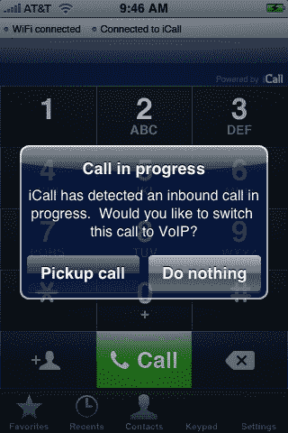
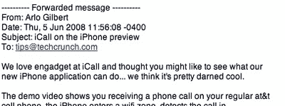

# iCall 为 iPhone 带来无缝免费 VoIP 

> 原文：<https://web.archive.org/web/https://techcrunch.com/2008/06/06/icall-brings-seamless-voip-to-iphone/>

# iCall 为 iPhone 带来无缝免费网络电话

我要打电话给一家名为 [iCraw](https://web.archive.org/web/20221006000610/http://www.icall.com/) 的公司，该公司刚刚发布了一款适用于 iPhone 的 VoIP 系统，只要你碰到一个开放的热点，它就能让你在通话过程中加入 VoIP 网络。它还提供免费拨打美国和加拿大的电话。下周应该可以在苹果 iPhone 应用商店买到。由于[我真的很喜欢 T-Mobile 的](https://web.archive.org/web/20221006000610/http://www.crunchgear.com/2008/06/02/productivity-on-the-road/) [Hotspot@Home UMA 产品](https://web.archive.org/web/20221006000610/http://www.t-mobile.com/)，这听起来是一个节省一些钱并在非 T-Mobile 手机上获得更好通话质量的好方法。以下是功能列表:

> *通过 WiFi 拨打和接听电话
> *将普通手机上的来电立即转移到 WiFi 上
> *访问相同的地址簿
> *定制您的语音邮件选项

为什么现在是 iCraw？也许如果创始人能在他们的电子邮件应用程序中解决邮件合并问题…

【YouTube http://www.youtube.com/watch?v = anoq 5w 3m kmu & rel = 0 & border = 1 & color 1 = 0x 006699 & color 2 = 0x 54 Abd 6 & HL = en]