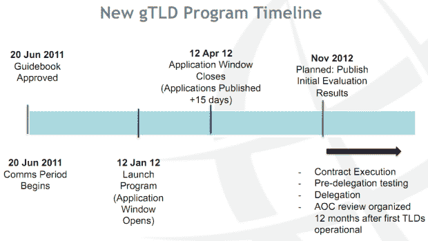

# ICANN 将扩大顶级域名，申请于 2012 年 1 月 12 日开始 TechCrunch

> 原文：<https://web.archive.org/web/http://techcrunch.com/2011/06/20/icann-to-expand-top-level-domain-names-applications-start-jan-12-2012/>

# ICANN 将扩大顶级域名，申请于 2012 年 1 月 12 日开始

ICANN 委员会[投票批准](https://web.archive.org/web/20230203043608/http://www.icann.org/)新的 gTLD 项目，该项目于三年前首次宣布。新计划将显著扩大顶级域名，允许公司、组织甚至城市将自己的品牌转化为域名扩展。想想吧。阿迪达斯，。酒店，。布鲁塞尔，。FACEBOOK 之类的。

新 gTLDs 的申请将于 2012 年 1 月 12 日至 2012 年 4 月 12 日接受。

根据目前的路线图，第一批将于 2013 年底投入使用。

ICANN 理事会成员在新加坡举行的国际大会的第一天投票，13 票赞成，1 票反对，2 票弃权。今年早些时候，该组织的理事会与 ICM Registry 签订了运营[的合同。XXX 顶级域名](https://web.archive.org/web/20230203043608/https://techcrunch.com/2011/03/20/adult-websites-will-soon-get-their-own-xxx-brothels-but-not-all-are-excited/)成人网站之类的。

目前，共有 22 个通用顶级域名，包括。com，。org 和. net。

ICANN 表示，新引入的通用顶级域名可能会改变人们在互联网上查找信息的方式，以及企业规划和构建其在线存在的方式。

ICANN 在一份声明中表示:“互联网地址名称将能够以任何语言中的几乎任何单词结尾，这为世界各地的组织提供了以新的创新方式营销其品牌、产品、社区或事业的机会。”

然而，重要的是要注意，只有“已建立的公共或私人组织”才能申请，新域名扩展的价格标签是[陡峭](https://web.archive.org/web/20230203043608/http://lauren.vortex.com/archive/000871.html)——除非你认为 185，000 美元很划算。尽管如此，预计即使是这个价格也会有很多人感兴趣。

申请人必须证明对他们所购买的域名拥有合法权利——据报道，ICANN 正在聘用数百名顾问，并将评估此类权利主张的工作外包给他们。此外，gTLD 所有者还将维护运营网站，努力将大规模域名抢注的风险降至最低。

另请参阅: [ICANN 继续使用非拉丁语网址(视频)](https://web.archive.org/web/20230203043608/https://techcrunch.com/2009/10/30/icann-moves-ahead-with-non-latin-web-addresses-video/)

(上图来自 [ICANN 网站](https://web.archive.org/web/20230203043608/http://www.icann.org/))

