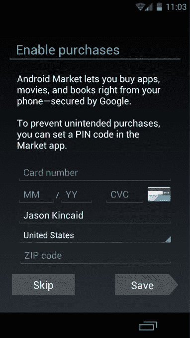

# 冰淇淋三明治提示用户加入 Google+，输入信用卡信息 

> 原文：<https://web.archive.org/web/http://techcrunch.com/2011/11/17/ice-cream-sandwich-prompts-users-to-join-google-enter-credit-card-information/>

# 冰淇淋三明治提示用户加入 Google+，输入信用卡信息

谷歌在新版本的安卓系统中引入了一个看似微小的变化，即[冰激凌三明治](https://web.archive.org/web/20230205040134/https://techcrunch.com/2011/11/17/my-first-day-with-the-galaxy-nexus-and-ice-cream-sandwich-this-is-really-big/)，实际上可能会像各种 UI 调整一样对该公司产生巨大影响:任何人在手机中输入谷歌账户凭证(这意味着几乎所有人)都会被提示注册 Google+。他们还会被提示输入在 Android Market 购物的信用卡信息。

这真的是一件大事。Android 现在每天激活超过 550，000 台设备，并且这一增长一直在稳步增加。这将会产生一大批新的 Google+用户，或者至少是注册 Google+账户的人。*。随着谷歌继续将 Google+功能注入 Android，他们可能会越来越积极地使用它。*

信用卡要求也很重要。Android Market 显然已经接受谷歌结账的信用卡信息多年了。但我怀疑，人们会更倾向于在谷歌账户的初始设置过程中输入这些信息，而不是第一次购买付费应用时(那时他们可能只是耸耸肩，找到一个免费的替代品)。一旦谷歌掌握了你的信用卡信息，它将更容易让用户使用其他优质服务，如 Chrome 网上商店和谷歌钱包。

