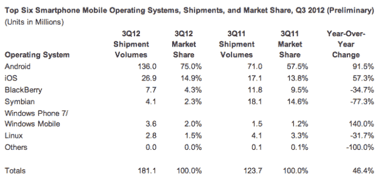
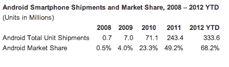

# IDC:2012 年第三季度，Android 全球市场份额达到 75% 

> 原文：<https://web.archive.org/web/https://techcrunch.com/2012/11/02/idc-android-market-share-reached-75-worldwide-in-q3-2012/>

根据分析公司 IDC 发布的新数据[显示，2012 年第三季度 Android 出货量达到 1.36 亿台，占该季度 1.811 亿台出货量的 75%。或者，正如 IDC 所说，“2012 年第三季度出货的智能手机中，四分之三搭载了安卓操作系统。”](https://web.archive.org/web/20221208151545/http://www.businesswire.com/news/home/20121101006891/en/Android-Marks-Fourth-Anniversary-Launch-75.0-Market)

当然，请记住，我们看的是出货数字，而不是在这里销售。不过，这表明了 Android 在全球市场的吸引力。

Android 最近的增长很大程度上受到了三星上个季度数据的影响。根据 T2 几家分析公司本周早些时候发布的数据，三星现在拥有大约 31%- 35%的智能手机市场份额。(具体来说，ABI 将其定为 35%，Strategy Analytics 为 35.2%，IDC 为 31.3%)。IDC 表示，由于许多较小的供应商增加产量，三星的市场份额实际上略有下降，但由于旗舰手机 Galaxy S III 的受欢迎程度，三星的出货量为 5630 万部。相比之下，苹果[在此期间售出了](https://web.archive.org/web/20221208151545/http://www.apple.com/pr/library/2012/10/25Apple-Reports-Fourth-Quarter-Results.html)2690 万部 iPhones。

综合来看，第三季度 Android 智能手机出货量达到创纪录的 1.36 亿部，高于上一季度的 1 亿部。IDC 显然对这次发布的戏剧性很有天赋，它指出 Android 第三季度的总销量比 2007 年 Android 正式发布的那一年的智能手机总出货量还要多。([现在请随意哦和啊](https://web.archive.org/web/20221208151545/http://www.statista.com/topics/840/smartphones/)。)

iOS 排在第二位，但它是本季度唯一一个市场份额达到两位数的移动操作系统，份额为 14.9%。不过，请注意，iPhone 5 是在本季度末发布的，其销售的全面影响尚未显现。

在失败者中:黑莓的份额跌至略高于 4%，Symbian 公布了迄今为止最大的同比跌幅(-77.3%)，市场份额仅为 2.3%。如果有人想知道 Android 是从哪里找到所有新用户的，那么，这就是了。事实上，IDC 高级分析师凯文·雷斯蒂沃(Kevin Restivo)向那些没有做出关联的人阐述了这一点，他说，“自 Android 推出以来，除 iOS 之外的智能手机操作系统的份额下降并不是巧合。智能手机操作系统不是一个孤立的产品，它是一个更大的技术生态系统的重要组成部分。谷歌拥有欣欣向荣、多元化的产品组合。它的许多竞争对手与移动操作系统的联系较弱，不具备这种能力。这一因素和其他因素导致了竞争对手的份额损失，很少有例外。”

与此同时，较新的播放器 Windows Phone 在第三季度的全球出货量仅为 360 万部，低于 Symbian 的 410 万部。它的市场份额现在是 2%，略高于第三季度“Linux”的 1.5%。然而，随着 Windows Phone 8 的推出，Windows Phone 仍有希望。