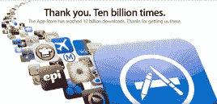

# IDC 预测，到 2015 年，移动应用下载量将达到 1830 亿次，应用内购买的增长 TechCrunch

> 原文：<https://web.archive.org/web/http://techcrunch.com/2011/06/28/idc-predicts-183-billion-mobile-app-downloads-by-2015-rise-of-in-app-purchasing/>

# IDC 预测，到 2015 年，移动应用下载量将达到 1830 亿次，应用内购买将会增加

研究公司 [IDC](https://web.archive.org/web/20230204095739/http://www.crunchbase.com/company/idc) [预测](https://web.archive.org/web/20230204095739/http://www.idc.com/getdoc.jsp?containerId=228221)到 2015 年，年度移动应用下载量将从 2010 年的 107 亿次增长到[近 1830 亿次](https://web.archive.org/web/20230204095739/http://www.businesswire.com/news/home/20110628005647/en/IDC-Forecasts-183-Billion-Annual-Mobile-App)，明显超过其竞争对手 [ABI 研究](https://web.archive.org/web/20230204095739/http://www.crunchbase.com/company/abi-research)预测的到 2016 年[440 亿次移动应用下载量](https://web.archive.org/web/20230204095739/https://techcrunch.com/2011/04/28/users-will-download-44-billion-mobile-apps-by-2016/)。

IDC 表示，这些数字背后更大的故事是，目前依赖移动应用下载购买作为应用货币化的主要焦点，这种转变即将发生。

相反，IDC 表示，开发者将越来越多地关注应用内购买和广告，以资助商业模式，该公司表示，这种转变在免费应用类别中最为明显。

去年 1 月，在 2011 年 1 月的 Appcelerator/IDC 1Q11 移动应用开发者调查报告中，IDC 认为开发者越来越多地[计划](https://web.archive.org/web/20230204095739/http://www.pcworld.com/article/217654/future_iphone_ipad_apps_smart_engaging_maybe_costly.html)将应用内购买、移动广告和移动商务整合到他们的移动应用中。

IDC 表示，其对移动应用市场的展望是根据与“移动应用市场中各种各样的参与者”的对话，以及财务和产品公告和对 Appcelerator 的 7 万多名移动应用开发者的季度调查得出的。

两个月前，IDC 报告称，今年第一季度，全球手机市场大幅增长，同比增长 19.8%，主要是由于智能手机出货量的激增。

为了你进一步的阅读乐趣:

到 2016 年(2011 年 4 月)，用户将下载 440 亿个移动应用

[移动应用用户既善变又忠诚:研究](https://web.archive.org/web/20230204095739/https://techcrunch.com/2011/03/15/mobile-app-users-are-both-fickle-and-loyal-study/)(2011 年 3 月)

[报道:到 2015 年](https://web.archive.org/web/20230204095739/https://techcrunch.com/2011/01/18/report-mobile-app-market-will-be-worth-25-billion-by-2015-apples-share-20/)(2011 年 1 月)，移动应用市场将价值 250 亿美元

[Gartner 预测 2011 年移动应用商店收入将达到 150 亿美元](https://web.archive.org/web/20230204095739/https://techcrunch.com/2011/01/26/mobile-app-store-15-billion-2011/)(2011 年 1 月)