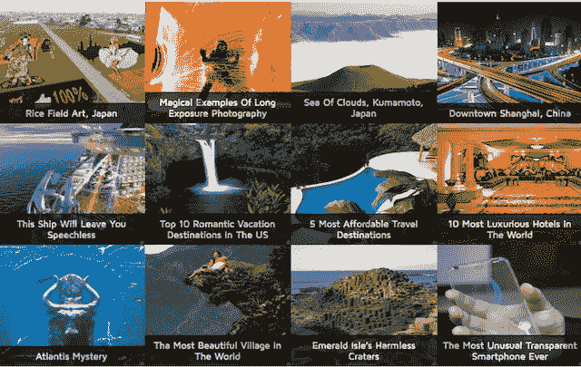

# 理想媒体采取更实际的方法将推荐内容与广告相结合 

> 原文：<https://web.archive.org/web/https://techcrunch.com/2013/09/06/ideal-media-takes-a-more-hands-on-approach-to-combining-recommended-content-with-ads/>

# 理想媒体采取更实际的方法将推荐内容与广告结合起来

这里有另一家尝试将内容推荐转化为业务的初创公司:[理想媒体](https://web.archive.org/web/20221206120143/http://www.idealmedia.com/)。

与 [Outbrain](https://web.archive.org/web/20221206120143/http://www.outbrain.com/) 和 [Taboola](https://web.archive.org/web/20221206120143/http://www.taboola.com/) 的概念类似，Ideal Media 与出版商合作，在他们的页面上添加推荐内容单元。然后，它通过在组合中包含赞助内容来赚钱。你可以在 OneBigPhoto 网站的这张照片下的[里看到一个例子(下面有截图)。销售总监 Matthew Mosk 通过电子邮件告诉我，Ideal Media 正在构建定制的本地集成，因此外观会因网站而异。](https://web.archive.org/web/20221206120143/http://onebigphoto.com/light-trails-of-speed-tokyo/)

莫斯克补充说，理想媒体的部门不仅在网络上工作，还在移动、社交媒体和平板电脑上工作，它有“高度针对性的渠道战略(汽车、体育、科技、健康、女性等)。”但真正的不同之处，或者至少是他强调的一点，是该公司不仅推广内容，还帮助客户创造内容——理想的媒体团队将为其广告商提供免费的内容营销服务。

为什么这很重要？嗯，Mosk 说他的公司将能够创造出真正有趣和相关的内容，而不仅仅是一个简单的广告:

> 许多品牌刚刚意识到，网络用户正在忽视展示广告，并开始意识到一种更微妙和细致入微的方法——内容营销——的价值。此外，网络用户变得如此精明，以至于当他们点击一个他们认为是故事的链接时，他们会变得超级沮丧，但最终会将他们引向一个明目张胆的广告(这种情况发生在一些内容发现网络上)。理想的媒体正在弥合这一差距。

(不幸的是，Mosk 无法向我提供 Ideal Media 的内容创作技巧样本，所以我无法直接判断所讨论的内容是否真的比大多数广告更好。)

是的，Mosk 说 Ideal Media 计划继续免费提供内容创作，尽管它可能开始对更多的优质内容营销服务收费。

为了比较，我还问了 Outbrain 它是否提供自己的内容营销服务。一位发言人告诉我，该公司不写任何内容，但它确实收购了 Scribit，该公司允许客户从《赫芬顿邮报》等出版物中搜索内容。

~~回到理想媒体，该公司由埃德尔·奥尔金创建，他过去的角色包括在虚拟粉丝网络担任首席收入官。它是由奥尔金和他的朋友和家人资助的。~~ **更新，2016 年 12 月:**现任 CEO 亚历克斯·巴伦(Alex Baron)表示，奥尔金既不是公司的创始人，也不是投资者。