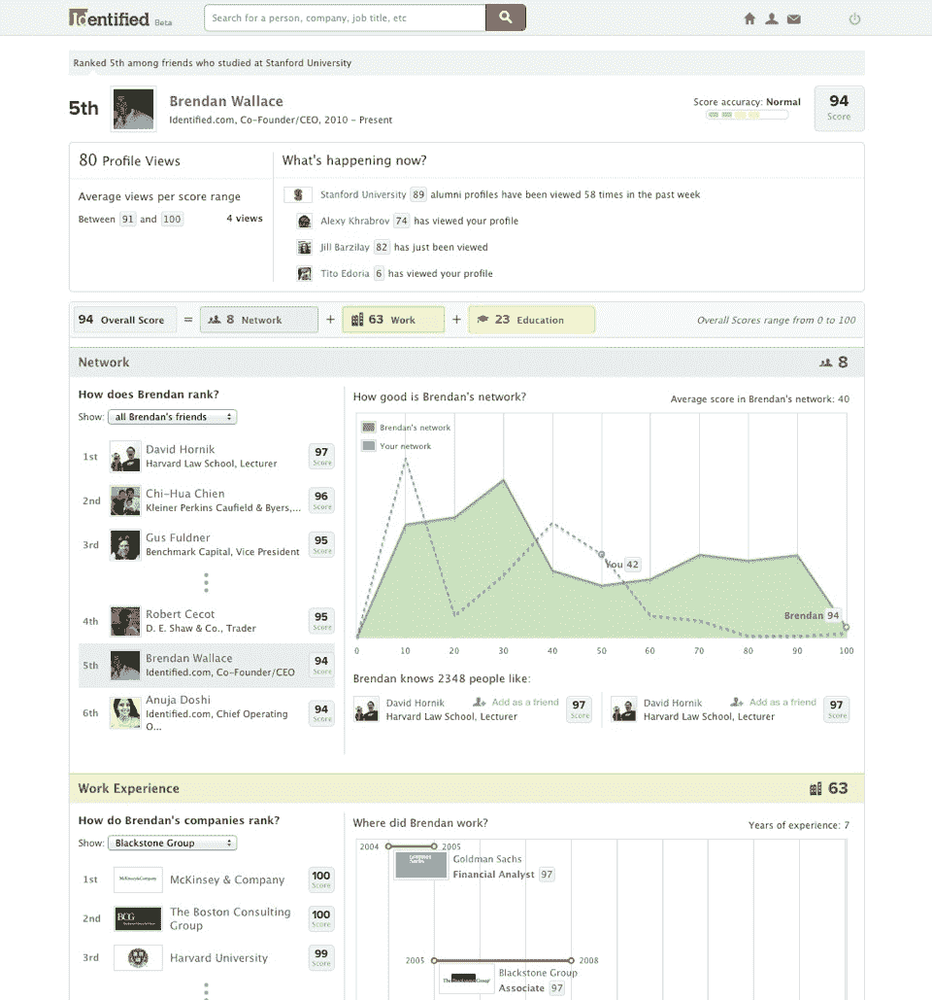
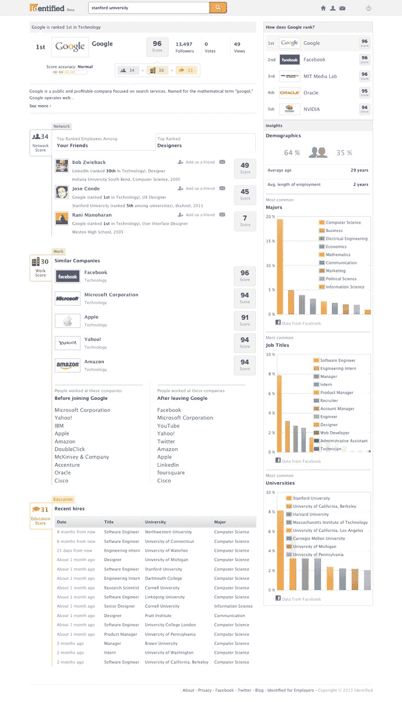

# 面向专业人士的搜索引擎 Identified 向公众开放其 5000 万份排名 

> 原文：<https://web.archive.org/web/https://techcrunch.com/2011/11/10/identified-the-search-engine-for-professionals-opens-public-access-to-its-50-million-rankings/>

LinkedIn 拥有超过 1 亿用户的庞大专业社交网络，无疑是一项伟大的业务——也是一项有价值的服务。当然，LinkedIn 和其他职业网络和工作平台的问题是，个人和企业之间缺乏真正的对话。毫无疑问，企业正在寻找优秀的人才，但他们希望找到更可靠的方法来为他们的空缺职位找到最相关的候选人，求职者希望有更好的工具来找到与他们的背景相关的排名靠前的公司，这些公司在候选人身上寻找什么，他们希望得到反馈。

今年 9 月，斯坦福大学商学院(Stanford Business School)的两个毕业生布伦丹·华莱士(Brendan Wallace)和阿德耶米·阿姚(Adeyemi Schmidt)推出了名为 [Identified](https://web.archive.org/web/20221224164206/http://www.identified.com/) 的测试版，这是一个基于脸书数据的专业求职引擎，旨在与 LinkedIn 和 BranchOut(以及其他公司)竞争，为求职者和公司提供更好的联系和寻找人才的方式。Identified 的主要特点是所谓的“识别分数”，它根据专业人士的工作经历、教育背景和社交网络，给他们分配一个数字等级(满分 100 分)。

华莱士和阿姚称这些排名为“人们的谷歌页面排名”；就像搜索巨头根据网站与某些搜索词的相关性对网站进行排名一样，Identified 也利用其得分对专业人士进行排名。排名是相关性的代表，因此基于用户最新的背景信息，他们将出现在与他们最近工作相关的类别搜索中，等等。

通过使用来自脸书的元数据，Identified 已经为超过 5000 万人创建了列表，尽管其中只有 15 万人是月活跃用户。但这仅仅发生在测试版发布后的六周内。已经有成千上万的人每天都在访问确定的分数，以评估招聘、销售、网络、背景调查等方面的专业人员。更重要的是，迄今已有超过 180 万份分数被浏览，Wallace 表示，数千家公司已经请求访问这些分数，以预先筛选招聘候选人。

但华莱士说，这里的真正价值在于，被识别用户的平均年龄是 24 岁，超过 90%的用户年龄在 30 岁以下。随着各公司争相雇佣最优秀的年轻人才，Identified 为企业提供了一种简单、基于分数(和基于相关性的搜索)的方法来寻找人才。

今天，Identified 正式推出了它的公共测试版，现在将向这 5000 多万名专业人员提供免费和开放的访问(面向公司和公众)。这意味着所有确定的分数现在都是公开的，任何人都可以在网上搜索和访问(并将在谷歌搜索中弹出)，包括公司。谢天谢地，隐私设置将被包括在内。

就这一点而言，Identified 还提供 6 万多家公司和 8000 多所大学的分数，华莱士说，该公司看到的许多早期注册都来自员工，他们希望在公司或大学的列表中添加更多相关信息，以提高他们的分数。这种游戏化可能是 Identified 的一个巨大障碍。

随着其他用户或公司的兴趣(通过查看次数、点击次数和实际雇佣次数)导致已识别的分数上升，一个人在个人资料中添加的内容越多，其分数上升的可能性就越大，这可能是因为他们在搜索排名中的位置更高。华莱士认为，这种“你添加的越多，你的排名就越高”，游戏化的方法为用户提供了更高程度的参与机会，因为与他们的排名互动具有现实世界和职业影响。

当然，将他们的分数公开，任何人现在都可以查看 5000 万人的分数，这可能会引起一些争议，但 Identified 已经内置了控制，因此非身份用户只能查看注册用户的公司和个人资料。

然而，Identified 排名系统的另一个问题是:举例来说，如果你没有去常春藤盟校，但你仍然是一名出色的工程师，会怎么样？由于在脸书数据的基础上建立平台的目的是让人们围绕他们实际交往的朋友和同事(在脸书也算“朋友”)创建网络，如果用户显示出令人印象深刻的职业历史和与顶级工程师的强大联系/关系，那么没有上过“顶级学校”就变得不那么相关了。

当然，确定的分数并不意味着反映一个人的“实际价值”——仅仅因为你有“65”，你的朋友有“80”，并不一定意味着你的朋友是一个更好的人，更聪明，等等。在某种意义上，公司的分数就像股票价格，因为它们不一定反映一个人真正的内在价值，而是基于相关标准——在这种情况下是搜索术语。分数并不完美。

即便如此，Identified 为劳动力市场增加了一定程度的透明度，并为公司和专业人士之间开辟了一条迄今为止尚不完善的沟通渠道。能够根据你的职业经历了解你有多“抢手”，哪些公司在寻找像你这样的员工，以及反过来，你如何让自己对雇主更具吸引力——对于职业社交领域来说，这是向前迈出的宝贵一步。

虽然还不完美，但这是朝着正确方向迈出的一步。Identified 是否会成为 LinkedIn 的潜在收购目标，或者只是一个彻头彻尾的竞争对手，还有待观察。但是，根据华莱士的说法，他们已经看到 LinkedIn 上一些知名的名字一直在查看这个网站。

投资者当然很感兴趣，因为这家初创公司已经从谷歌董事长 Eric Schmidt、比尔和蒂姆·德雷珀、前脸书副总裁 Chamath Palihapitiya、Farmville 创始人赵阳等人那里筹集了 550 万美元。

更多关于已确认的信息，请点击查看，或者点击查看罗宾的[初始报道。](https://web.archive.org/web/20221224164206/https://techcrunch.com/2011/09/19/backed-by-top-notch-investors-professional-search-engine-identified-aims-to-rival-linkedin/)

