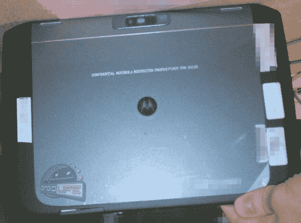

# 如果一个摩托罗拉安卓系统的标签泄露了，它就像其他的一样，这真的有关系吗？

> 原文：<https://web.archive.org/web/http://techcrunch.com/2011/09/24/if-a-motorola-android-tab-leaks-and-its-just-like-the-rest-does-it-really-matter/>

很明显，一个新的 Xoom 正在酝酿中。很大的惊喜，对吧？旧的已经接近它的八个月生日了，由于 Android 的快速老化过程，在这一点上它和 Handspring Visor 一样重要。但是说真的，还有人在乎吗？我这样问并没有恶意或讽刺。我是认真的:现在还有人关心蜂窝板吗？

蜂巢本该是 iOS 杀手。它应该站起来，挑战强大的 iOS，并通过多任务和开放的强大组合最终杀死冠军。但这并没有发生，主要是因为消费者不在乎那些废话。他们想要应用程序，而蜂巢的应用程序很少。因此，现在安卓平板电脑坐在零售商的端盖和货架上，挤在一起，分享一块电源砖的温暖，只希望有人会想出如何解锁他们的屏幕。

回到我那个不受任何邪恶偏见影响的问题。几乎可以肯定的是，摩托罗拉会发布第一代 Xoom 的继任者。最初的 Xoom 是第一款蜂巢平板电脑，它被认为是 Android 忠实用户的约书亚，并清除了 iPad 反叛者的消费者景观。公司不会发布一个产品，看看会发生什么，然后开始开发下一个模型。不，他们绘制了路线，今天泄露的只是摩托罗拉安卓之旅下一站的细节。

[规格听起来不错](https://web.archive.org/web/20230203131331/http://thisismynext.com/2011/09/24/exclusive-motorola-xoom-2-specs-details-netfli/):8.2 英寸高清 IPS 屏幕，一个未命名的 1.2GHz CPU，更快的内存，网飞高清，1080p 摄像头，以及一个红外发射器，以防你想要一个大尺寸的电视遥控器。根据 ThisIsMyNext 的说法，所有这些都装在一个 9 毫米厚的外壳中。这比 iPad 2 的 8.8 毫米厚多了 0.2 毫米，如果这对你很重要的话。([向机器人致敬——生活图片](https://web.archive.org/web/20230203131331/http://www.droid-life.com/2011/09/23/exclusive-first-pictures-of-the-motorola-xoom-2/#more-47255))

但是 specs 不卖平板电脑。大多数消费者都在寻求不同于台式机或笔记本电脑的体验。不知不觉中，他们在寻找持久的新鲜感。当然，有些消费者想要多任务处理，有些想要可调整的界面，也许有些人甚至想要一个有七个主屏幕和一个应用抽屉的平板电脑。这就是 Android 平板电脑的用武之地。然而，iPad 以一种略微新颖的便携式计算模式吸引了消费者，并且以其风格和档次做到了这一点。

Android 平板电脑制造商将效仿 PC 笔记本由来已久的每季度发布新产品的传统，窃取自己的收入。这款即将推出的 Xoom 机型将会抢走第一代 Xoom 的销量，同时看起来除了一个更小的外壳之外什么都不会提供。它将进一步分化 Android 粉丝，并最终稀释吸引力。

关于这款下一代 Xoom 平板电脑，我们知之甚少。它也许可以遵循其前任的开拓精神，推出第一款冰淇淋三明治平板电脑，这将重启 iPad 的宣传机器，但很可能再次失败。毫无疑问，一些评论者会大声疾呼，在产品发布之前就宣布它不相关或不受欢迎还为时过早，更不用说发布了。他们会说我们没有掌握所有的事实，或者这款平板电脑可能会有所不同，或者甚至，消费者正在寻找比大 iPod touch 更好的东西。当我说黑莓 Playbook(当时代号为 BlackPad)将会崩溃时，他们也是这么说的。([这里是帖子](https://web.archive.org/web/20230203131331/https://techcrunch.com/2010/07/30/the-rim-blackpad-is-going-to-crash-and-burn-just-like-the-storm/)，但是当 TechCrunch 吞并了 CrunchGear 之后，这几百条评论就没了)

听着，我不是一个讨厌安卓的人。我是一个非常好奇的旁观者。我看着新的 Android 平板电脑，就像我看着我的 Droid X 和新的 Android 手机一样，并得出结论，新手机，比如 Galaxy S II，除了 4G 无线电之外，缺乏任何新的引人注目的功能。

选择是好事。但通常，这来自于多年的零售工作，太多的选择淹没了普通消费者，他们只想带着最新的小工具和最少的麻烦进出商店。因此，在百思买(Best Buy)的一个货架上，摆着一打安卓平板电脑，价格相差不到 100 澳元，处理速度和内存类型几乎完全相同。然后，在五英尺之外，iPad 2 正在用其轰动一时的应用程序做广告，在这些应用程序中，唯一的选择是 3G 或 WiFi 以及白色或黑色。显然，一款新的摩托罗拉安卓平板电脑将很快加入它的行列，但除非它的价格标签为 100 美元，否则它不会引起任何关注。