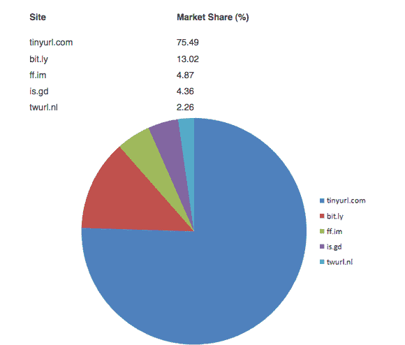
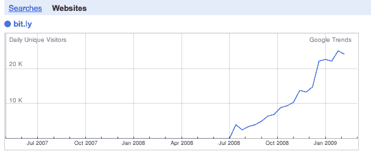
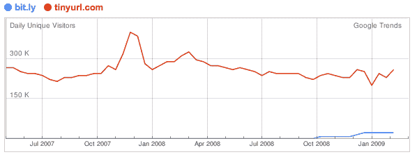

# 如果 bit.ly 值 800 万美元，TinyURL 至少值 4600 万美元 TechCrunch

> 原文：<https://web.archive.org/web/https://techcrunch.com/2009/03/30/if-bitly-is-worth-8-million-tinyurl-is-worth-at-least-46-million/>

# 如果 bit.ly 值 800 万美元，TinyURL 至少值 4600 万美元

在一个所有内容都被塞进 140 个字符或更少的世界里，越短越好。那是双倍(还是一半？)对于冗长的网址。对于任何使用 Twitter 的人来说，所谓的 URL 缩短服务正变得越来越不可或缺。这是在服务上共享链接的唯一可行的方法。

今天，这些网址缩短服务之一， [bit.ly](https://web.archive.org/web/20221006211716/http://bit.ly/) 筹集了 200 万美元，引发了这样一个问题:[这些东西到底值多少钱？](https://web.archive.org/web/20221006211716/http://www.techmeme.com/090330/p69#a090330p69)没有人真正知道。

但是这里有一些有趣的数学。假设 bit.ly 将 20%的股份出售给了新投资者(奥莱利阿尔法科技基金、米切尔·卡普尔和霍华德林德森)，这意味着 800 万美元的投资前估值(1000 万美元的投资后估值)。根据 Tweetmeme 的计算，其缩短链接的市场份额仅为 13%。最大的网址缩短者实际上是 TinyURL，它占据了 75%的份额。所以按照这个标准，如果 bit.ly 值 800 万美元，TinyURL 应该至少值*4600 万美元(8/13 X 75 = 46.15)。是的，我在编造这些数字，就像投资者一样。*

但是等等。Bit.ly 似乎正在像火箭一样猛升，而 TinyURL 可能已经[停滞](https://web.archive.org/web/20221006211716/http://trends.google.com/websites?q=tinyurl.com%2C+bit.ly&geo=all&date=all&sort=0)。为什么 bit.ly 增长这么快？一个很大的原因是因为它创建的【TinyURL 甚至比 TinyURL 短了大约五个字符(http://bit.ly/比 http://tinyurl.com/)。不要笑。每个字符都很重要。Bit.ly 还在后端提供了更好的分析和跟踪工具。

不过，也不要太在意网站流量的增长数字。http://bit.ly/和 http://tinyurl.com/的流量不能作为可靠的使用指标，因为大量用户不会去相应的网站。他们使用桌面客户端或基于浏览器的工具，而不是结合一种或另一种服务。例如，TweetDeck(一个流行的 Twitter 客户端)使用 bit.ly 作为它的默认缩写。bit.ly 服务本身是 Betaworks 的副产品，beta works 也是 Tweetdeck(以及 Twitter)的投资者。看到它是如何工作的吗？

任何一个网址缩短器应该如何赚钱还不清楚。链接本身作为原始站点的通道。TinyURL 在自己的网站上贴了一些谷歌广告，bit.ly 甚至都不在乎。每项服务收集的数据可能很有价值，可以以各种方式打包提供给品牌营销人员或其他企业买家。。。也许吧。或者更有可能，这些东西成为其他服务的特性。

Digg 已经在开发自己的 [URL 缩短工具栏](https://web.archive.org/web/20221006211716/http://www.beta.techcrunch.com/2009/02/26/digg-is-working-on-a-toolbar-to-go-after-stumbleupon-tinyurl-and-all-the-rest/)打包到它的服务中，而 [Stumbleupon 正在开发 su.pr](https://web.archive.org/web/20221006211716/http://www.beta.techcrunch.com/2009/03/12/stumbleupon-to-launch-supr-shorturl-service/) ，它甚至比 bit.ly 还要短！

