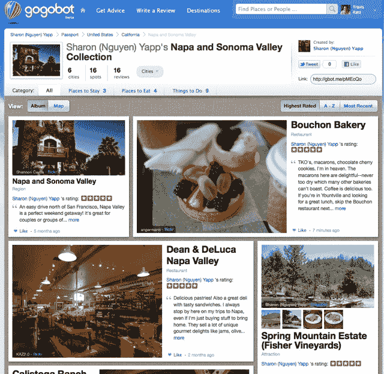

# 如果 Gogobot 还没有吸引你，这个新的类似 Flipboard 的布局将 

> 原文：<https://web.archive.org/web/https://techcrunch.com/2011/07/20/if-gogobot-hasnt-sucked-you-in-already-this-new-flipboard-like-layout-will/>

# 如果 Gogobot 还没有吸引你，这个新的类似 Flipboard 的布局将会

Gogobot 是一家真正特别的初创公司。设计精美和非常有用是很少能在一起找到的两样东西，但是 Gogobot 两者都有。

我们[去年第一次报道了](https://web.archive.org/web/20230203131233/https://techcrunch.com/2010/03/29/former-myspace-exec-teams-with-yahoo-rock-star-for-new-startup/)。但是直到 2010 年 11 月，他们才[推出产品](https://web.archive.org/web/20230203131233/https://techcrunch.com/2010/11/16/gogobot/)——一个创建和消费真实人物对他们所去过的地方的评论和照片的地方。

这项服务使得对你旅行时去过的餐馆、酒店和其他地方进行评价和评论变得极其容易。你可以搜索内容——这比你在 Travelocity 等网站上找到的内容要干净和有用得多(例如，查看他们对[毛伊岛酒店](https://web.archive.org/web/20230203131233/http://www.gogobot.com/maui-hawaii--hotels)或[在罗马要做的事情](https://web.archive.org/web/20230203131233/http://www.gogobot.com/rome--things_to_do)的搜索结果)，并且很容易点击一个按钮，将你看到的推荐内容添加到你的旅程中。

但是有趣的部分是创造内容。GogoBot 让这一切变得简单。Foursquare 和脸书[的整合](https://web.archive.org/web/20230203131233/https://techcrunch.com/2011/05/03/gogobot-gets-lots-more-interesting-with-foursquare-facebook-integration/)允许服务监控你在哪里公开签到，然后提示你稍后离开评论。Gogobot 会自动将你旅行中的照片和评论归入相册。

直到现在，这些收藏/相册/护照看起来都不那么漂亮。

### 旅行系列

这项新功能被称为旅游收藏。你的旅行被发布在一个漂亮的类似 Flipboard 的布局中。

> 新功能允许用户以丰富的色彩和背景分享他们的冒险经历——这是一个数字时代的增强型剪贴簿。用户可以从 Gogobot 网站上分享他们的照片、评论和其他关于他们住宿、用餐和旅行的地方的细节。新的收藏布局还允许用户无缝集成他们在其他社交媒体网站的活动——包括他们在脸书和 Foursquare 上的签到——以及 Gogobot 的专业照片。所有这些元素都被打包到关于每个地方的页面中，让朋友们了解更多关于你的旅行，看到日落时你在哪里的地图，甚至可以预订你住的酒店。这些元素以一种干净优雅的格式呈现，带有一个交互式地图，允许用户以一种简化的、包装精美的布局与他们的社交网络分享假期，同时让朋友们可以轻松地使用这些信息来计划自己的旅行。

您还可以通过一个新的地图功能来查看行程，该功能可以显示所有东西的位置，以便更好地了解旅行的背景，您何时去了哪里，以及附近的其他酒店、餐厅和景点。查看首席执行官特拉维斯·卡茨的伦敦相册，点击顶部的“地图视图”查看这是如何工作的。分享我看过的度假照片和推荐，没有比这更好的方式了。