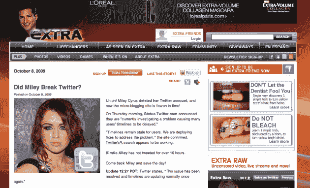

# 如果青少年不使用推特，那我为什么要读麦莉·赛勒斯的故事？

> 原文：<https://web.archive.org/web/https://techcrunch.com/2009/10/08/if-teens-don%e2%80%99t-use-twitter-then-why-do-i-have-to-read-about-miley-cyrus/>

# 如果青少年不使用推特，那我为什么要读麦莉·赛勒斯的故事？

你可能已经读过过去一个月的头条新闻，称青少年不使用 Twitter。如果没有，[去这里](https://web.archive.org/web/20230404001427/http://www.google.com/search?sourceid=chrome&ie=UTF-8&q=teens+don't+use+twitter)，关于它的故事有几十个，包括不下[两个](https://web.archive.org/web/20230404001427/https://techcrunch.com/2009/07/13/why-teens-arent-using-twitter/) TechCrunch [帖子](https://web.archive.org/web/20230404001427/https://techcrunch.com/2009/08/30/why-dont-teens-tweet-we-asked-over-10000-of-them/)。我今天想知道的是，如果是这样的话，为什么麦莉·塞勒斯退出 Twitter 会引起这么大的轰动？

好吧，是的，有可能有很多——我该怎么说呢……变态的——绅士们在那里乞求她回来。毫无疑问，鉴于 [#mileycomeback](https://web.archive.org/web/20230404001427/http://twitter.com/#search?q=%23mileycomeback) 已经成为 Twitter 上全天的热门话题，垃圾邮件机器人正在那里紧跟这一趋势。但是，今天我已经在网上看过这个故事十几次了。路透社有，美联社有，华尔街日报有，每日电讯报有。然后当然是娱乐报刊:MTV，娱乐周刊，号外等。我之前在 CNN 上看到过。为什么有人关心青少年，赛勒斯的观众，不使用 Twitter？

查看#mileycomeback [结果](https://web.archive.org/web/20230404001427/http://twitter.com/#search?q=%23mileycomeback)，大多数推文(确实有大量的推文)看起来确实来自真正的青少年。许多人请求她的父亲(是的，前穆莱特先生，[比利·雷·塞勒斯](https://web.archive.org/web/20230404001427/http://twitter.com/billyraycyrus))说服她回来，其他人只是对她放弃了近 200 万名粉丝感到愤怒。但是大多数看起来是真实的人，是的，大多数看起来是青少年。

所以也许青少年不使用 Twitter，除非麦莉·塞勒斯退出，让她回到一个他们不使用的服务？或者，青少年不使用 Twitter 的想法根本不正确。我有点希望这是真的，这样我就可以不再听到麦莉·赛勒斯的事了。

回到娱乐媒体，我有点担心他们会侵占我们的地盘。通常情况下，是科技媒体开始抱怨 Twitter 宕机([就像今天早上](https://web.archive.org/web/20230404001427/https://techcrunch.com/2009/10/08/stuck-in-the-twitter-jam-try-this-hidden-route/))，并提出阴谋论来解释为什么会这样。但是现在像 Extra 这样的商店正在加入进来。"[麦莉破推特了吗？](https://web.archive.org/web/20230404001427/http://extratv.warnerbros.com/2009/10/did_miley_cyrus_break_twitter.php)，”他们问。没有真正的证据支持这一点——除了，柯尔斯蒂·艾利没有超过 16 个小时发微博？什么？

事情已经到了这种地步。

