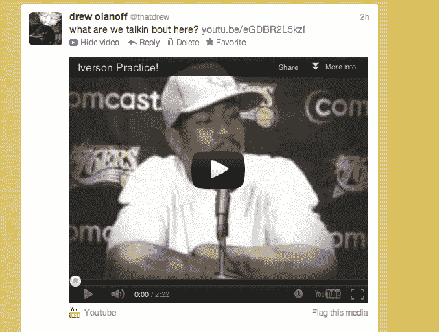

# 如果 Twitter 进入视频托管领域，这将是一件美妙而可怕的事情

> 原文：<https://web.archive.org/web/https://techcrunch.com/2012/10/09/if-twitter-gets-into-the-video-hosting-game-it-could-be-a-wonderful-and-horrible-thing/>

# 如果 Twitter 进入视频托管游戏，这可能是一件美妙而可怕的事情

据 AllThingsD 报道，Twitter 已经决定通过收购纽约初创公司 [Vine](https://web.archive.org/web/20230404210136/http://vine.co/) 进入视频托管业务。我们已经联系了 Twitter，但目前还无法证实这一点。

如果属实，这标志着 Twitter 的一个重要里程碑，Twitter 在转变为媒体巨头方面处于完全的攻击模式。现在，由于 Twitter 自己的服务，你可以上传照片附加到你的推文中，这可能是在该服务上分享照片最简单的方式。对于 Twitter 和即将发布的 Vine 来说，视频是合乎逻辑的下一步，但这对该公司来说可能会变得非常棘手。

你看，你已经可以在脸书和 Google+等服务上分享照片和视频了。主要的区别是你可以控制谁可以看到内容。在 Twitter 上，你有两个选择:公开或私人。这意味着人们会基于这个限制来做出分享或不分享的决定。

我在暗示什么？我们将会看到一些不适合“黄金时段”播放的尴尬可笑的视频。动态图片超越了一切，即使是一张简单的照片。一张某人即将登上照相机的照片和一段某人正在做这件事的视频是不同的。

在你问“但是 Socialcam 和 Viddy 这样的服务呢？一样的东西！”不尽然，因为 Twitter 的游戏是分发…快速分发。全球范围内。

Twitter 加入这场游戏是有意义的，因为它严重依赖 YouTube 和其他平台为每个人的粉丝提供视频服务。然而，现实世界中的人会犯现实世界中的错误。

举个例子:你朋友有点醉了，你用手机拍了一段很美的视频。一瞬间，你和你的朋友决定“YOLO！我要分享这个。”你不能收回。一旦上了推特，就满城风雨了。你可以在 YouTube、Google+和脸书上收回一些东西，但在 Twitter 上就没那么容易了。这是用户对服务的心态——如果我们看到它，它就发生了。

Twitter 如何通过帮助用户免于羞辱来让这种体验变得更好？我不知道。也许那不是他们的工作。我的观点是“做视频”不仅仅是提供一些云存储和处理。打造一个稳定的视频平台需要投入很多。

我没用过[藤](https://web.archive.org/web/20230404210136/http://vine.co/)。我没见过这个团队。我希望，如果这一切都是真的，Twitter 已经开始考虑潜在的后果。

[图片来源: [Flickr](https://web.archive.org/web/20230404210136/http://www.flickr.com/photos/chaparral/305741456/)