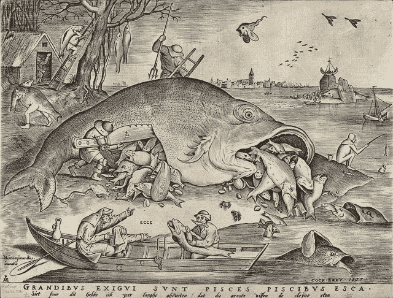

# 随着维基解密的封锁，支付机构选择了他们不知道的魔鬼 

> 原文：<https://web.archive.org/web/http://techcrunch.com/2011/10/24/if-you-strike-me-down-i-shall-etc/>

你可能同意维基解密的使命。或者你可能认为他们是一个威胁。或者介于两者之间。但有一点你不能否认:他们是一个组织，有一个领导者，一个名字，还有(无论隐藏得多好)服务器，银行账户，等等。他们也有原则——同样，这可能不是你喜欢的，但他们至少存在:删除某些识别信息，只通过某些方式发布给媒体，等等。

世界上主要的支付机构正在阻止人们向维基解密捐款。我想这是他们的特权，当然，他们的参议员和议员会有一个适合否则。但我不确定他们是否意识到他们将面临什么。他们一定不熟悉九头蛇。

这是我在过去几个月里第二次求助于这个比喻，让我既高兴又失望。[8 月](https://web.archive.org/web/20230203093748/https://techcrunch.com/2011/08/26/one-head-at-a-time-dept/)，唱片公司关闭了一项无害且非常不独特的服务，这项服务让你从视频分享网站下载视频。他们未能理解这种打击有多么无关紧要，而且他们很可能只会让自己的情况变得更糟。

但那只是钱和版权的问题。维基解密的风险更高一些。

一旦维萨、万事达和其他公司将维基解密化为乌有，他们会期待发生什么？他们这样做的原因几乎肯定是政治性的，而这些政治性的原因根植于对政府不透明、不受公众监督的担心。无论你是否同意维基解密理想化的透明度(即有些事情必须保密)，很明显，猫已经从袋子里出来了。

为什么维基解密需要钱呢？他们筛选、编辑、标记、分发等等的信息量是巨大的。他们提供的服务显然有需求。就像在 Napster 时代对音乐的数字下载有需求一样。但是维基解密不是 Napster。Napster 是免费的，本质上是数据不可知的，混乱的中立者，如果你愿意的话。维基解密是全球泄密管理的 T4 iTunes T5。它是一个已知的实体，集中的，连接的(虽然可能不喜欢)。如果他们被迫关闭，需求会发生什么？

哦，看，又一幅有教育意义的版画。

我就不绕弯子了。接下来会发生的是，被维基解密(以及其他一些成长中的、半合法的泄密组织)筛选的信息无论如何都会被分发出去，不管用什么方便的方式。它将是混乱的，不可控制的，不可编辑的，完全掌握在最不可能对此负责的人手中。这种情况是不可避免的吗？大概吧。但这并不意味着我们应该急于实现它。

这真的是一个你认识的魔鬼或你不认识的魔鬼的问题。不幸的是，像 Visa 这样的政府和机构束手无策。他们不能做出正确的选择，因为这在政治上是站不住脚的。最终，对所有相关的人来说，结果都会更糟。