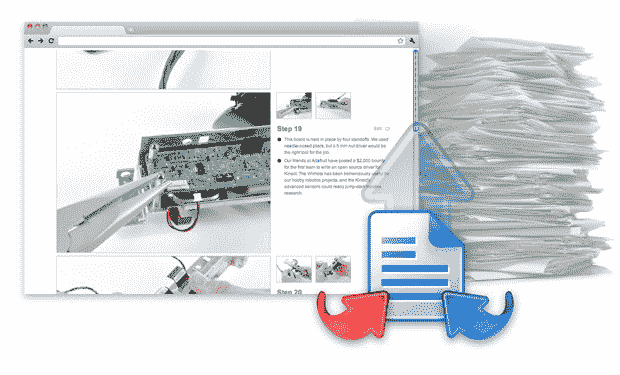

# iFixIt 推出 Dozuki，一项手册云服务 

> 原文：<https://web.archive.org/web/http://techcrunch.com/2011/08/18/ifixit-launches-dozuki-a-cloud-service-for-manuals/>

# iFixIt 推出 Dozuki，这是一项手册云服务

以苹果升级指南和用品闻名的 iFixIt ，正在向硬件、电器和化学制造商的云服务领域拓展。这个名为 Dozuki 的新项目目前处于测试阶段，它旨在通过创建一个类似 Wiki 的文档和操作环境来简化技术文档的流程。

该公司在过去的一年里一直在用 Make Magazine 测试他们的软件，他们指出 Autodesk 收购 Instructables 是一个例子，说明这种环境对于颠覆来说是多么成熟。iFixIt 首席执行官[凯尔·威恩斯](https://web.archive.org/web/20230203050117/http://www.ifixit.com/User/Contributions/2/Kyle+Wiens)说:“我认为 AutoDesk 收购 Instructables 表明大笔资金正在追逐这个领域。

“技术文档行业非常庞大，而且现有的软件也相当陈旧，”他说。Dozuki 已被用于为 iFixIt 客户创建简单的说明，该计划正在扩展到像 Ryobi 和 Home Depot 这样的公司。例如，客户可以使用一个基于云的服务器创建一个像[这样的手册，用于 Xbox](https://web.archive.org/web/20230203050117/http://www.ifixit.com/Guide/Installing-Xbox-360-Red-Ring-of-Death-Fix-Kit/3550/1) 的 RROD 补丁。整个团队可以分别谈论设备的每个部分——例如，考虑一个关于木工和金属加工主要硬件项目的“操作指南”文件夹——并在店内或购买后为客户提供有用的提示。

“你有很多工具的维修手册，但它们都是传统的 PDF 格式，”Wiens 说。“你可以把它们放到网上，作为一个在线社区的开端，也许你的工具手册只是一个开端——你鼓励你的客户分享如何用你的工具制作东西。”

“所以他们有关于如何学习管道的所有有用信息，他们出售所有的零件，但他们没有让人们容易地将两者联系起来。我们会给他们一个在线操作网站和一个面向消费者和销售点的移动应用程序。”

“这是我们从 iFixit 中学到的重要经验。如果我们不教他们如何使用，人们就无法使用我们的产品。”

该网站目前处于测试阶段，将于今年秋季推出。你可以注册一个测试账户，这项服务对小公司客户来说大约需要 100 美元，对大公司来说需要 499 美元。你可以在这里看到[定价](https://web.archive.org/web/20230203050117/http://www.dozuki.com/Sales/Plans/guidebook)。“大公司社交内容软件的现行价格略高于每年 10 万美元，”凯尔说。

“机会是巨大的，”他说。“我不是一个估值过高的人，因为我不必向风投推销，但我们会赚上百万。”希望他为我们其他人做好之后能做一个指南。

顺便说一下，这是一个手冢治虫。这是一种用于非常精确切割的日本锯。

[产品页面](https://web.archive.org/web/20230203050117/http://www.dozuki.com/Sales/Guidebook#strategicDocumentation)