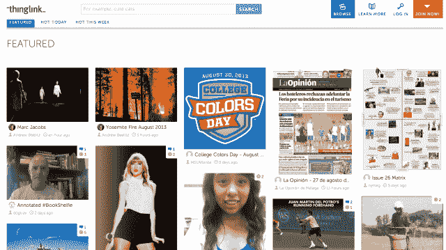
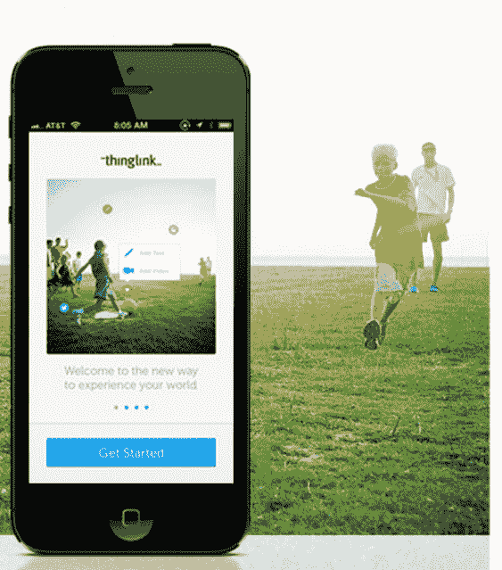

# 图片标签平台 ThingLink 再斩获 200 万美元 

> 原文：<https://web.archive.org/web/https://techcrunch.com/2013/08/28/image-tagging-platform-thinglink-grabs-another-2-million/>

ThingLink 是一个平台，可以在图片中标记音乐、视频、笔记等内容的链接，该公司今天宣布获得了 200 万美元的额外资金。新一轮由赫尔辛基的风险投资公司 Inventure Oy 牵头，纽约和旧金山地区的天使投资人也参与了进来，包括 Terrapin Bale，前 Tumblr 总裁 John Maloney，Fremantle Media N.A .首席执行官 Thom Beers，Trimaran Capital 管理合伙人 Dean Kehler，SoundCloud 首席技术官 Eric Wahlforss，以及芬兰技术和创新融资机构 TEKES。

ThingLink 迄今为止的总资金为 390 万美元。

这家初创公司现在位于纽约和赫尔辛基，最初是由 Ulla Engeströ在 2008 年创立的，他最初的灵感是将在线信息和其他故事与现实世界中的实物联系起来。她尝试在衣服和其他物体上缝上贴纸，这可以通过支持 NFC 的手机激活。在一位朋友的建议下，她将这些标识符称为“thinglinks”，这位朋友现在是投资者，是 SoundCloud 的联合创始人埃里克·沃尔弗斯(Eric Wahlforss)。

后来，这一概念扩展到了照片，2010 年，thinglink.com 推出了一个公开版的图像标记工具，允许任何人向在线图像添加内容，然后可以在网络上发布。

自那以后，正是这个工具找到了自己的立足点，吸引了数字营销者、企业和品牌的兴趣。例如，大西洋唱片公司是该平台的早期采用者之一，用它来推广 Simple Plan 的带有互动图像的“Get Your Heart On”CD。迄今为止，ThingLink 已经与一些品牌合作，如[《时尚》](https://web.archive.org/web/20221006041316/http://www.vogue.com/vogue-daily/article/index-annex/#1)、[施乐](https://web.archive.org/web/20221006041316/http://www.xerox.com/)、[家得宝](https://web.archive.org/web/20221006041316/http://www.thinglink.com/homedepot)、[布兰妮](https://web.archive.org/web/20221006041316/https://www.thinglink.com/scene/411238380743950338#tlsite)(是的，她是一个品牌)、[华盛顿邮报](https://web.archive.org/web/20221006041316/https://twitter.com/washingtonpost/status/361171641373425664)、[纽约杂志](https://web.archive.org/web/20221006041316/http://nymag.com/arts/all/approvalmatrix/approval-matrix-2013-7-22/)、[奔驰](https://web.archive.org/web/20221006041316/http://www.thinglink.com/scene/423136856146706432)等等。与此同时，其他人，包括[微软](https://web.archive.org/web/20221006041316/https://twitter.com/Office365/status/351768467772407808)、 [CNET](https://web.archive.org/web/20221006041316/https://www.facebook.com/cnet/posts/10151666451347275) 、[福布斯](https://web.archive.org/web/20221006041316/http://forbes.tumblr.com/post/44068665685/explore-this-interactive-image-industry-atlas)、 [Groupon](https://web.archive.org/web/20221006041316/https://twitter.com/Groupon/status/360927529219002368) 和[乔治·阿玛尼](https://web.archive.org/web/20221006041316/http://dressingthebest.armani.com/)，已经在社交媒体上使用 ThingLink，比如在他们的脸书页面、推特账户或博客上。

该公司总共拥有超过 220，000 家出版商，包括前 10 大报纸中的 4 家，以及前 50 大全球品牌中的 10 家。客户使用 ThingLink 将以前的静态图像转变为互动的，有时甚至是“可购买的”内容，其中包含启动视频播放器、社交媒体链接或其他第三方应用程序的图像热点。

对于企业客户，ThingLink 每月收取 500 美元至 1500 美元的年费。与此同时，广告活动根据总浏览量收取固定费用，通常从几百美元到几千美元不等。Engeströ告诉我们，生活方式品牌活动范围的点击率平均在 10%左右。但是音乐表现最好。“我们还没有看到一个流行(音乐)品牌的流行活动点击率不会超过 50%，”她说。“粉丝们喜欢发现，如果有机会在一个乐队的图像中隐藏独家内容，他们会徘徊不前；他们会推翻每一块石头。”

除了布兰妮品牌，其团队最近通过 Twitter 发布了一段视频，其中使用了 ThinkLinked 的动画 gif，该公司还为发电厂乐团、平克·弗洛伊德和街头霸王乐队等乐队提供了可点击的图像。

虽然 ThingLink 主要由品牌和企业使用，但它也在 5 月份推出了一款 ThingLink 移动应用，让用户可以建立自己的 thing link。“我们希望成为在移动设备上观看互动图像的目的地，”Engeströ解释道。该公司目前提供 Twitter 卡集成以及原生应用程序。她拒绝透露该应用的下载量或活跃量，但指出 ThingLink 现在有一半的浏览量来自手机，通过手机注册的用户数量正在增加。

有了这笔额外的资金，首席执行官 Engeströ将从芬兰赫尔辛基迁至纽约市，前《新闻周刊》/《每日野兽》高管、现任首席收入官的 Hillary Billingsley 正在纽约组建销售团队。该公司正准备在纽约扩大销售和客户支持，同时在赫尔辛基增加工程师。

Tumblr 前总裁、投资者约翰·马洛尼(John Maloney)表示，他投资这家公司是因为恩格斯特伦本人。“这是一个小团队，他们非常努力。她有远见，她坚韧不拔，她不怕调整策略和重复，”他说。"她愿意把这件事纳入一家公司."

由于新的资金，该公司还扩大了董事会，增加了娱乐媒体风险投资公司首席执行官桑迪·克里曼和前脸书媒体销售总监克雷格·科布伦兹。

ThingLink 与像 [Luminate](https://web.archive.org/web/20221006041316/http://www.luminate.com/) 和 [Stipple](https://web.archive.org/web/20221006041316/https://stipple.com/) 这样的初创公司竞争，这些公司也专注于将商业和其他链接整合到图像中。

虽然 ThingLink 不再是公司早期的产品，但 Engeströ看到了物理标签和今天的平台之间的联系。“我仍然把人和事物联系在一起，”她说。“在测试期间，我们将品牌与喜爱其产品的人联系起来。我们仍在做同样的事情。”