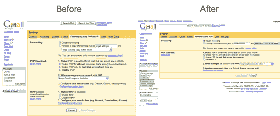

# Gmail 不再支持 IMAP 更新]

> 原文：<https://web.archive.org/web/https://techcrunch.com/2008/04/16/imap-support-disappears-from-gmail/>

# Gmail 不再支持 IMAP 更新]

看起来谷歌已经停止了对 IMAP 的支持，尽管还不清楚这是一个临时的决定，一个错误的结果，还是一个永久性的政策改变。谷歌在 10 月份首次推出对 IMAP 的支持。

IMAP 允许电子邮件用户使用替代客户端(如桌面应用程序 Thunderbird 或 mail)管理电子邮件，而无需像 POP 那样创建邮件副本。这意味着用户永远不必使用 Gmail 网络界面，可以有效地绕过谷歌在那里的所有广告。

我们已经联系了谷歌，以确定这次失踪的原因。我们收到回复后会进行更新。

在[的官方 Gmail 博客](https://web.archive.org/web/20221005235635/http://gmailblog.blogspot.com/)上还没有发布任何关于此事的消息，Gmail 帮助中心[仍然有使用 IMAP 和 Gmail 的说明](https://web.archive.org/web/20221005235635/http://mail.google.com/support/bin/answer.py?hl=en&answer=75725)。

感谢提示，[马克](https://web.archive.org/web/20221005235635/http://www.verus.ca/)。

**更新:**大家不要惊慌，IMAP 支持又回来了…希望能保持下去。我们还在评论中听到用户在聊天方面也有问题。

**更新 2:** 谷歌向我们发送了这份官方回复，并没有提供任何关于问题原因的信息，只是承认确实发生了问题:

> “Gmail 用户在今天大约半个小时的时间里无法使用 Gmail 的某些功能，包括 IMAP 访问和聊天。该问题现已解决。我们知道 Gmail 对我们的用户有多重要，所以我们非常重视这样的问题，我们鼓励任何人在使用 Gmail 时遇到任何形式的技术困难，通过 [Gmail 帮助中心](https://web.archive.org/web/20221005235635/http://mail.google.com/support/)联系 Gmail 支持团队。”