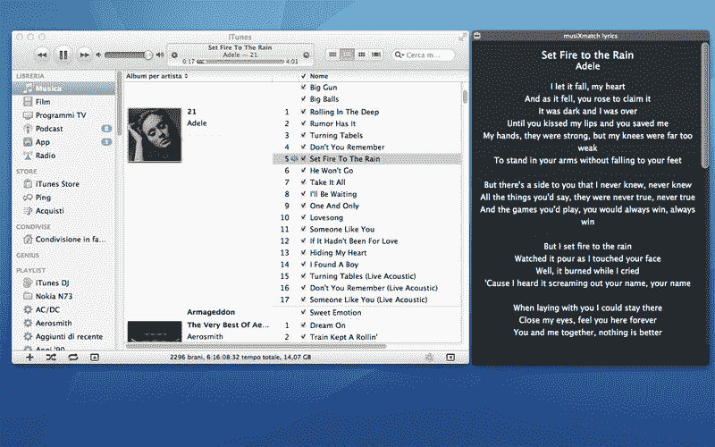

# musiXmatch，歌词的 IMDB，来到 iTunes & Spotify 超过 100 万次移动下载 TechCrunch

> 原文：<https://web.archive.org/web/http://techcrunch.com/2011/09/20/imdb-for-song-lyrics-musixmatch-launches-widget-for-itunes-spotify-passes-1m-mobile-downloads/>

我不知道你怎么样，但我很难记住歌词，我经常求助于谷歌搜索来回答我的歌词问题——而且经常会输掉争论。显然，我并不孤单，因为“歌词”是谷歌上搜索次数最多的词汇之一。虽然快速搜索通常是一个人所需要的，但总的来说，歌词搜索仍然是一个非常令人失望(和沮丧)的体验。有大量的歌词网站，但大多数都是非官方的，没有权利传播免费的歌词，或者他们隐藏着恶意软件。

成立于 2010 年的 [musiXmatch](https://web.archive.org/web/20230203124335/http://musixmatch.com/) 是一家试图解决这个问题的初创公司，它通过在网络上建立一个合法歌词的数据库，希望成为合法歌词的 IMDB。到目前为止，该网站已经收集了超过 550 万首歌曲(18 种语言)，不仅正在建立一个符合国际版权管理标准的数据库，而且还在开发一个 API，以将歌词分发给音乐出版商、服务、应用程序开发人员和黑客。唷。

今天，musiXmatch 宣布正式推出其用于 Mac OSX 的[“musix match 歌词应用”](https://web.archive.org/web/20230203124335/http://itunes.apple.com/us/app/musixmatch-lyrics/id454723812?mt=12)，在 App Store 上售价 5 美元。该插件使用户能够自动全屏查看他们当前播放的音乐的歌词，并支持 iTunes 和 Spotify。

该工具仍处于早期阶段，该团队表示，它将很快让音乐粉丝能够通过艺术家、歌曲名称或关键词搜索歌词，浏览专辑和艺术家的唱片目录信息，并通过社交网络与朋友分享这些信息。(另一个很酷的更新正在进行中:让听众能够自动将歌词嵌入到你的歌曲的 id3 标签中。)

对于像我这样的 iTunes 和 Spotify 用户来说，musiXmatch 的小工具是现有收听体验的一个非常酷的小插件，因为它会自动匹配你的 iTunes 和 Spotify 库(并自动打开这两个库)，与两个平台的“广播”功能兼容，允许你将歌词分享到脸书和 Twitter，并接收咆哮通知。(和 Lion 一起工作。)

除了今天推出其 iTunes 和 Spotify 兼容的 iOS 插件，musiXmatch 还与我们分享了他们的移动应用程序，这些应用程序可在 iOS，Android，Symbian 和 Windows Mobile 上使用，已被下载超过 100 万次。超过 50%的用户每天都很活跃。

musiXmatch 的移动解决方案允许用户轻松地为他们的整个移动音乐库查找和匹配歌词，借助桌面可用性，一个让开发人员轻松分发犹太歌词的可爱 API，这家初创公司正在成为一个非常有吸引力的服务，从广播流媒体平台和视频服务到平板电脑应用程序和 OEM 制造商。与包括 BMG、Kobalt、环球音乐出版集团和索尼 ATV 音乐等在内的合作伙伴合作，musiXmatch 正在成为一个非常有趣的业务和平台。

但是，你说竞争呢？好吧，我的朋友们，只要看看 TuneWiki 就知道了。虽然 musiXmatch 是一个后起之秀，但资金雄厚的 TuneWiki 已经用其以歌词为中心的社交音乐播放器移动了很长一段时间。MusiXmatch 现在基本上相当于欧洲的音乐。观察两家公司如何争夺市场份额将是一件有趣的事情。

你会选择哪个，还是两个都选？[看看他们。](https://web.archive.org/web/20230203124335/http://musixmatch.com/)