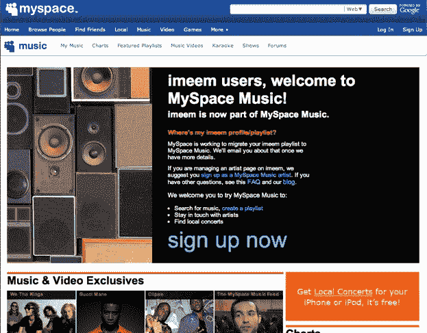

# 好了，现在完成了。MySpace Music 完成对 iMeem  的收购

> 原文：<https://web.archive.org/web/https://techcrunch.com/2009/12/08/imeem-myspace-music-completes-acquisition/>

# 好了，现在完成了。MySpace Music 完成对 iMeem 的收购

MySpace Music 已经完成了对音乐服务 iMeem 大部分资产的收购。

上个月，我们首次披露了 MySpace 接近收购 iMeem 的消息。两天后，我们报道说签署了一份[协议，以 100 万美元现金购买该公司的资产。](https://web.archive.org/web/20230326025029/https://techcrunch.com/2009/11/18/myspace-signs-agreement-to-acquire-imeem/)

然而，交易没有完成，因为 MySpace Music 将要购买的一些资产(即服务器)实际上是租赁的。所以必须在[完成](https://web.archive.org/web/20230326025029/https://techcrunch.com/2009/12/07/hold-on-myspaceimeem-deal-aint-done-yet-being-renegotiated/)。最终价格不到 100 万美元，这意味着 MySpace Music 几乎可以免费获得 iMeem 品牌和用户。额外的收入也是交易的一部分，但并不多。

与 iLike 的收购不同，iMeem 被 MySpace Music 收购，而不是 MySpace。MySpace Music 是 MySpace 和唱片公司之间的合资企业。

但现在是[官方](https://web.archive.org/web/20230326025029/http://www.myspace.com/pressroom?url=/article_display.cfm?article_id=1126)。MySpace Music 将收购 iMeem 的部分剩余资产，并将其 1600 万月度用户转移到 MySpace Music。例如，他们所有的播放列表都将被迁移。创始人道尔顿·考德威尔，首席技术官布莱恩·伯格，首席运营官·阿里·艾达尔和销售副总裁大卫·韦德将在咨询的基础上监督过渡。目前还不清楚 IMeem 的其他员工会怎么样。Imeem 现在重定向到这个 l[and 页面](https://web.archive.org/web/20230326025029/http://www.myspace.com/imeem)。

