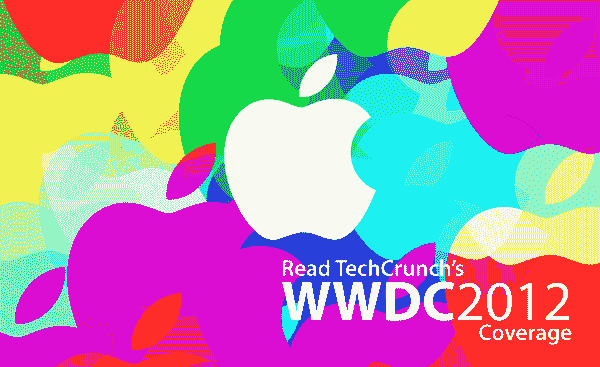

# iMessage 拥有超过 1.4 亿用户，发送了超过 150 亿条信息，每天发送的信息超过 1B

> 原文：<https://web.archive.org/web/https://techcrunch.com/2012/06/11/imessage-has-more-than-140m-users-and-has-150b-messages-over-1b-a-day/>

# iMessage 拥有超过 1.4 亿用户，发送了超过 150 亿条信息，每天发送的信息超过 1B

推出一年多后，苹果的斯科特·福斯特尔[今天](https://web.archive.org/web/20230326025701/https://techcrunch.com/2012/06/11/live-from-apples-wwdc-2012-keynote/)透露，苹果的短信杀手 iMessage 现在拥有 1.4 亿用户，每天发送超过 1500 亿条信息，超过 10 亿条。

Forstall 还透露，自从一年前宣布整合以来，Twitter 的 iOS 用户增长了 3 倍。现在有 100 亿条推文来自 iOS 5，Twitter 上 47%的照片来自 iOS 5。

他还谈到了一个事实，即前 100 名社交应用程序中有 84 个现在正在推送通知，每天有 70 亿条推送通知，总共有 1.5 万亿条推送通知。

特别是 iMessage 的数量在最新版本发布后将会增长，因为苹果公司透露，Mac 上的 iMessage 将在 Mountain Lion 中退出测试，并将通过通知中心在 Mac 和 iPad 上得到支持。

*更新中。*

