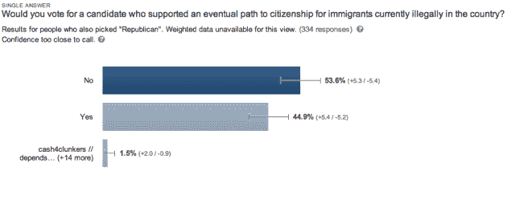
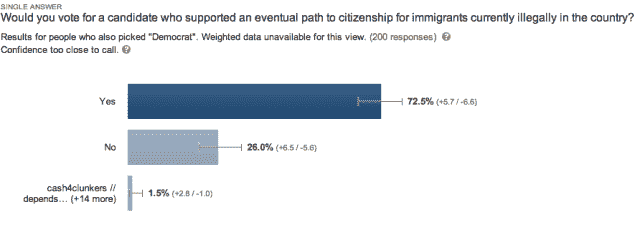

# 一项新的民意调查显示为什么移民改革今年可能不会通过

> 原文：<https://web.archive.org/web/https://techcrunch.com/2014/02/23/immigration-reform-not-pass-2014/>

爱荷华州共和党选民的一项新民意调查显示，为什么科技行业可能无法让国会通过移民改革——这是其首要政治目标。民意调查显示，爱荷华州 53%的共和党人不会投票给支持 1100 万非法居住在美国的无证工人获得公民身份的候选人。

看，[科技行业迫切需要](https://web.archive.org/web/20221224174539/https://techcrunch.com/2013/05/05/there-is-in-fact-a-tech-talent-shortage-and-there-always-will-be/)更多的外国工程师，但是国会[拒绝增加高科技工人的签证数量](https://web.archive.org/web/20221224174539/https://techcrunch.com/2012/12/01/no-exceptions-for-tech-industry-high-skilled-visas-now-tied-to-comprehensive-reform/)除非彻底改革整个移民系统。

不幸的是，2014 年是选举年，如果共和党在任者妥协通过一项全面的法案，他们可能会在选举中面临反弹。共和党人和民主党人不同意 1100 万低技能无证移民应该获得公民身份还是仅仅获得永久居留权。

负责在众议院起草高科技移民改革法案的共和党众议员达雷尔·伊萨今年早些时候告诉我们，全面的[移民改革至少在 2014 年中期选举之后才可能发生](https://web.archive.org/web/20221224174539/https://techcrunch.com/2014/01/07/immigration-reform-unlikely-to-pass-before-2015-says-rep-issa/)，因为共和党人在一项可能必须有一些公民身份条款的法案上妥协的政治风险太大。

为了测试 Issa 的想法，TechCrunch 与 Google Surveys 一起进行了另一项 CrunchGov 民意调查，看看在一个强烈支持共和党的中西部地区的公民是否会投票给一个支持允许无证移民成为公民的法案的候选人。

在著名的移民改革反对者、众议员史蒂夫·金所在的爱荷华州选区，53%自称为共和党人的人不会投票给一个支持非法劳工最终获得公民身份的候选人。

相比之下，72%(是的，72%)的民主党人会投票给支持公民身份之路的候选人。

共和党人担心不受欢迎的职位会让他们被茶党支持的候选人赶出办公室，这些候选人在过去的初选中成功地赶走了温和的共和党人。

我们当地的民意调查有助于解释众议院反对移民改革的原因，尽管全国民意调查一直显示大多数美国公众支持获得公民身份。相对少数的保守派说服了众议院的领导层，认为今年通过一项法案在政治上太危险了，尽管该法案广受欢迎。

与全国民调不同，地方民调揭示了在选举年加剧恐惧的看法。爱荷华州是展示这些恐惧的一个很好的关键测试案例；如果我们看到大多数爱荷华州人支持获得公民身份，那么我们将不得不寻找其他原因，为什么美国中部的共和党人不希望该法案通过。但是，正如我们的民意调查所显示的，共和党人确实可能面临强烈反对，使他们推迟对法案的投票，如果有的话。

事实上，对于这个问题的一点轻率，***每日秀*的乔恩·斯图尔特对阻止国会在移民改革上工作的内部政治有一个极好的(有趣的)解释。**

 **[Hulu id = g _ gwmuexognklgjfwujvg width = 512]

包括马克·扎克伯格支持的 [FWD.us](https://web.archive.org/web/20221224174539/https://techcrunch.com/2013/05/12/why-zuckerbergs-lobby-fwd-is-collapsing-like-a-house-of-cards-outside-of-dc/) 在内的科技游说团体已经投入了数百万美元来推动移民改革，但他们似乎没有比共和党中更有影响力的人更有影响力。

***对于统计学家**

CrunchGov 民调是使用谷歌调查微民调工具进行的，这是一种对互联网用户的概率抽样，已知可以准确地近似美国的代表性样本[ [PDF](https://web.archive.org/web/20221224174539/http://www.google.com/insights/consumersurveys/static/consumer_surveys_whitepaper.pdf) ]。[在过去的报道中](https://web.archive.org/web/20221224174539/https://techcrunch.com/2013/07/20/how-google-surveys-could-turn-anyone-into-a-professional-pollster-as-shown-in-1-graph/)，TechCrunch 用谷歌调查复制了皮尤政治民调。

对于这个故事，我们使用了一个公众还没有使用的功能:定位属于代表国王区的个人邮政编码的能力。我们的结果大致接近于由私人意识形态组织美国行动网络在同一地区进行的[前一次民意调查](https://web.archive.org/web/20221224174539/http://www.scribd.com/doc/155718809/Voter-Attitudes-on-Immigration-Reform-IA-4)。

不幸的是，美国行动网络在爱荷华州的民意调查中的措辞是如此厚颜无耻地带有偏见，民意调查本身就有严重的可信度问题。

例如，这是他们要求爱荷华州人评估的一项提案的措辞，“向从美国大学毕业的拥有高等学位的外国学生提供绿卡，这样我们就不再教育世界上最优秀和最聪明的人，然后把他们送回家与我们竞争。”

尽管他们的措辞(令人难以置信地)带有偏见，但只有 51%的共和党人支持获得公民身份，这给了我们的投票更多的信心。你可以点击查看并下载我们的调查数据[。](https://web.archive.org/web/20221224174539/https://www.google.com/insights/consumersurveys/view?survey=wbw5vzl7ootis)

[ [图片来源:Flickr 用户 thecrazyfilmgirl](https://web.archive.org/web/20221224174539/http://www.flickr.com/photos/thecrazyfilmgirl/3248283617/sizes/z/) ]**