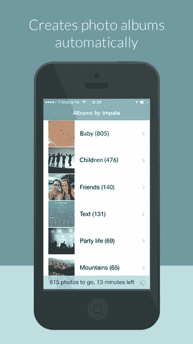

# Impala For iPhone 使用人工智能识别您的照片，并为您整理它们 TechCrunch

> 原文：<https://web.archive.org/web/https://techcrunch.com/2013/11/08/impala-for-iphone-identifies-your-photos-using-artificial-intelligence-organizes-them-for-you/>

一款名为 [Impala](https://web.archive.org/web/20221222050227/https://itunes.apple.com/us/app/impala/id736620048?ls=1&mt=8) 的新移动应用程序正在接替 Everpix 的工作，利用计算机视觉技术对你的照片集进行自动分类。一旦安装完毕，这款应用程序就会在你 iPhone 上的整个照片库中工作，将照片分类成各种类别，如“户外”、“建筑”、“美食”、“派对生活”、“朋友”、“日落”等等。但是 Impala 的功能和 Everpix 的工作方式有一个关键的区别。Impala 的移动应用没有服务器端组件——也就是说，你的照片没有存储在云中。处理照片分类的软件完全在你的设备上运行。

当然，Impala 不像 Everpix 那样是一款精致而专业的应用，照片分类是它唯一的技巧，而 Everpix 做得更多。但是它的分类能力并不可怕。在测试中，它在大约 20 分钟左右的时间里浏览了我的数千张 iPhone 照片，将照片放入不同的相册中，有些相册比其他相册更准确。例如，它在收集所有“食物”和“海滩”照片方面做得很好，可以很容易地区分“男人”、“女人”和“孩子”，但它将一些海滩场景归类为“山”，并将我的狗的照片归类为“猫”。

 但是后一个是设计出来的，黑斑羚的创造者和软件开发公司 [Euvision Technologies](https://web.archive.org/web/20221222050227/http://www.euvt.eu/) 的首席执行官哈罗·斯托克曼笑着说。“我们不喜欢狗，”他说。

这款应用目前的形式并不意味着是一项独立的业务，而是该公司软件技术能力的一个例子。

斯托克曼解释说，Euvision Technologies 是从阿姆斯特丹大学分离出来的，他在那里获得了计算机视觉博士学位。他告诉我们，使黑斑羚成为可能的技术已经发展了 10 多年。如今，Euvision 八人团队中的许多人也在该大学工作，该大学拥有该公司 15%的股份。

与此同时，Euvision 有权将该技术商业化，但没有外部资金。相反，它对其软件进行了许可，直到今天，这种软件只作为服务器技术提供给十几个客户使用，包括荷兰警察局(用于追踪虐待儿童的照片)，以及一个大型社交媒体网站，该网站在其网络上使用该技术进行照片审核。

通过将 Impala 放在 App Store 上，我们现在希望将这项技术介绍给更多的潜在授权客户。

不过，Stokman 指出，手机版本不如公司的核心产品准确。但它本身仍然是一项技术壮举。“我们没有风险资本，所以我们负担不起带宽和计算能力的费用，”他解释了为什么没有云组件。“我们被迫想出一些可以在手机上运行的东西。”

 鉴于 [Everpix 最近在本周关闭了其照片存储和共享平台](https://web.archive.org/web/20221222050227/https://techcrunch.com/2013/11/05/everpix-shutting-down/)，这一点尤其有趣。当时，该公司列举的原因之一是在亚马逊网络服务上托管用户照片的成本很高。事实证明，这是不可持续的成本。

Impala 放弃了使用云的想法，转而努力将其软件压缩到 100 MB 以下，低于他们刚开始开发该应用时的 600 MB。“软件需要存储模型的内存，这些模型使我们能够从来自朋友等的汽车中识别出婴儿，这需要大量的工作来压缩，”斯托克曼承认道。

与其他图像分类系统一样，Impala 使用人工智能和计算机视觉来“看到”照片中的内容。该系统使用来自客户端和网络上其他地方的成千上万的图像来训练，包括那些类似于该类别的图像(例如，“日落”或“室内”等。)以及那些与众不同的。

为了让该系统在移动设备上运行，该公司必须创建一个精简版的分类引擎。作为比较，当它在服务器上运行时，它需要四倍的计算能力。“计算能力越强，内存越多，结果就越好，”斯托克曼说。

 换句话说，由此产生的专辑在黑斑羚可能是命中或错过。这个应用程序也相当简单。在它浏览完你的照片后，你可以点击一个按钮将照片保存到你的 iPhone 照片库中。每个相册也有一个部分，其中列出了它不确定的照片，但目前没有办法手动批准或通过将它们移动到其他地方来重新组织这些项目。

至于那些被列为猫的狗？这不是针对个人的，只是黑斑羚的工程师更喜欢猫。“我们不喜欢狗，所以我们没有把这个类别放在那里，”斯托克曼开玩笑说。“你可以给狗拍照，它不会认出它们是狗。将会是猫，”他说。

如果这款应用大获成功，这可能会随着未来的改进而改变。目前，该公司正在开发下一款产品:一款相机应用程序，可以在你拍摄时立即识别 1000 个物体，比如太阳镜或键盘。他们将在即将到来的会议上提交该技术，并可能会考虑在以后的某个时间将该技术集成到 Impala 中。

iOS 版 impala[在这里](https://web.archive.org/web/20221222050227/https://itunes.apple.com/us/app/impala/id736620048?ls=1&mt=8)可以免费下载。

总部位于阿姆斯特丹的 Euvision Technologies 由哲学博士、理学硕士 Arnold Smeulders 教授共同创立，由 Stokman 和首席商务官 Jan Willem F. Klerkx 共同投资。