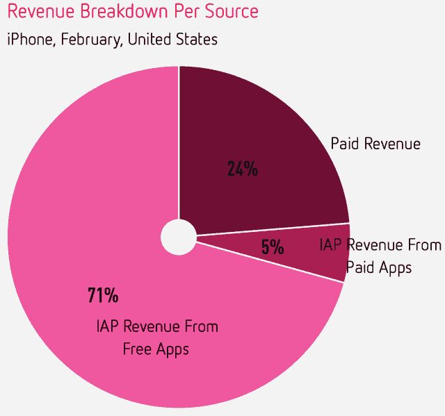
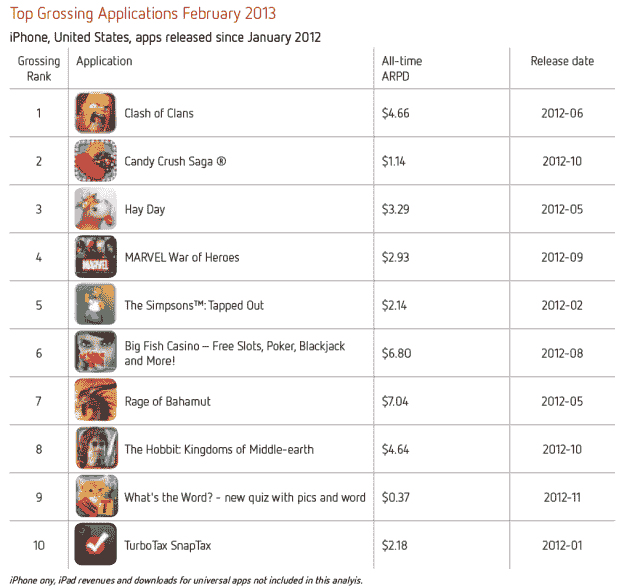
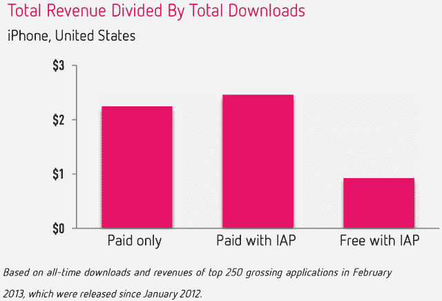
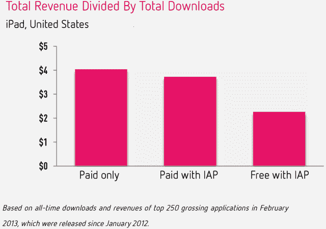
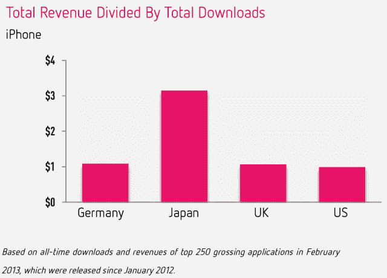

# 应用内购买收入创历史新高:占美国 iPhone 应用收入的 76%，亚洲市场的 90% 

> 原文：<https://web.archive.org/web/https://techcrunch.com/2013/03/28/in-app-purchase-revenue-hits-record-high-accounts-for-76-of-u-s-iphone-app-revenue-90-in-asian-markets/>

虽然众所周知，今天的许多移动应用程序通过应用内购买产生收入，但今天发布的一份新报告显示了这种赚钱机制已经变得多么强大。2012 年 1 月，美国 iPhone 应用商店收入的一半以上(53%)来自应用内购买，但截至上个月，这一数字已攀升至创纪录的 76%。

然而，这一数字因地区而异。例如，在德国，这一比例更低——2 月份只有 61%的收入来自这些应用内销售。与此同时，在亚洲市场，这一数字飙升。在香港、日本、中国和韩国，至少 90%的收入来自应用内购买。

【T2

这些发现在应用商店分析公司 Distimo 的最新报告[中披露，该报告对本月报告中的数据进行了深入研究。特别是，该报告研究了美国的趋势，关注了在 iPhone 上的移动应用中使用应用内购买的应用发行商选择的商业模式。](https://web.archive.org/web/20221209040318/http://www.distimo.com/report/download-latest)

毫不奇怪，Distimo 发现大多数(71%)应用程序是“免费增值”应用程序，这意味着应用程序本身是免费的，但一旦应用程序在 iPhone 上运行，其他功能、虚拟商品、额外级别、服务、升级等都可以出售。另外 5%使用应用内购买的应用是付费应用，美国大约四分之一(24%)的 iPhone 应用只是付费应用，不涉及应用内购买。

在拥挤的应用商店里，现在有大约 800，000 多个 iOS 应用可供选择，开发者发现他们的应用比以往任何时候都更难，更不用说安装了。给应用程序本身贴上价格标签被视为好奇或临时用户的进入壁垒，特别是考虑到苹果的应用程序商店尚未实施“先试后买”选项，类似于谷歌的安卓应用程序市场 Google Play，例如通过[易于访问的退款](https://web.archive.org/web/20221209040318/http://support.google.com/googleplay/bin/answer.py?hl=en&answer=134336)和[订阅内容试用](https://web.archive.org/web/20221209040318/http://developer.android.com/google/play/billing/billing_subscriptions.html#trials)提供的服务。争夺宝贵的主屏幕空间的应用程序开发者显然被逼到了采用这种商业模式的地步，尽管有时([和儿童应用](https://web.archive.org/web/20221209040318/https://beta.techcrunch.com/2013/03/04/apples-ipad-needs-a-kid-mode-like-yesterday/))如果没有适当的宣传，这几乎会给人留下不真诚甚至可疑的印象。

更多免费增值、基于应用内购买(IAP)的应用仍在发展。如上所述，与一年前相比，更多的应用程序通过这种方式产生收入。看看 2012 年 1 月以来发布的 2013 年 2 月票房最高的应用，*都是免费增值应用。*

Distimo 还调查了上个月收入最高的 250 个应用程序，也是自去年 1 月以来发布的应用程序，并估计了下载量和收入，以确定应用程序商店的指标 ARPD，即“每次下载的平均收入”由此得出的 ARPDs 范围显示，尽管整体商业模式是出版商倾向的模式，但它在每次下载基础上的表现却大相径庭。前 10 名的 ARPDs 从低至 0.37 美元到高达 7.04 美元。

为了确定哪种商业模式整体效果最好，Distimo 随后查看了总收入最高的 250 个应用程序，其中 170 个应用程序是 IAP 免费的，53 个应用程序是 IAP 付费的，27 个应用程序仅付费。(改变商业模式的应用程序被排除在分析之外。广告收入也没有计算在内。Distimo 称，所有 iPhone 应用的平均 ARPD 为 0.99 美元。

所有付费应用的价格为 2.25 美元，免费应用的价格为 0.93 美元。在使用 IAP 的用户中，付费应用的 ARPD 为 2.46 美元。

虽然上面的重点是 iPhone 应用商店，Distimo 也挖掘了 iPad 应用商店，以了解类似的趋势。在这里，平均售价往往更高。事实上，截至 2013 年 2 月，整个商店的平均价格为 4.46 美元，而 iPhone 为 3.19 美元。

对于没有 IAP 的付费应用，ARPD 为 4.04 美元，几乎是 iPhone 的两倍。带 IAP 的付费应用，3.72 美元。免费增值应用的价格为 2.26 美元，也高于 iPhone。

总的来说，Distimo 的结论是，iPhone 上付费应用程序每次下载的平均应用内收入为 0.98 美元，而 iPad 上为 1.26 美元。

报告随后转向非美国趋势，显示日本的 ARPD 尤其高。在该国收入最高的 10 个 iPhone 应用中，平均 ARPD 超过 12 美元。Distimo 指出，它从这个分析中抽出了“拼图与龙”，以防止只偏向这个游戏；如果把它包括在内，ARPD 会更高。

更多数据尽在[这里](https://web.archive.org/web/20221209040318/http://www.distimo.com/report/download-latest)。