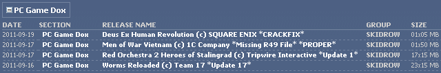
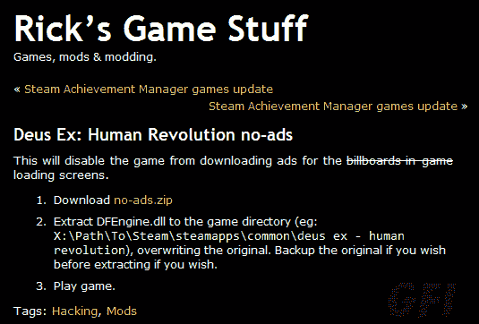

# 游戏内广告成为场景黑客的目标 

> 原文：<https://web.archive.org/web/http://techcrunch.com/2011/09/19/in-game-ads-become-the-target-of-scene-hackers/>

“场景”是一个松散的黑客网络，自软盘媒体时代以来就以这样或那样的形式存在，在许多方面是匿名的前身。与那个有点精神分裂的集体不同，这个场景的行进命令一直很明确:在它自己内部分发电影、电视、音乐和游戏——如果它们泄露给公众，那么，他们怎么处理是他们的事。

这种丰富的亚文化应该有自己的位置(事实上，仅仅是他们的 ASCII 艺术和 NFO 戏谑)，但今天他们正处于另一种改变的过程中，他们剥离了不必要的内容。首先是 NoCD，然后被破解了-DRM，也许现在，没有了-ads。

游戏内广告是目前游戏中的第三种方式。随着许多发行商和开发公司因首日 DRM、本应包含的“优质”内容以及平台专属项目和地图等问题受到抨击，对游戏内容的进一步开发可能会将更多游戏玩家推向黑暗面。一个典型的例子是:期待已久且广受好评的 [Deus Ex: Human Revolution](https://web.archive.org/web/20230205000339/https://techcrunch.com/2011/09/07/review-deus-ex-human-revolution/) 最近的一次更新，在加载屏幕上添加了新的*星球大战*蓝光的广告，让用户陷入疯狂。

他们的沮丧不难理解。他们*为这个游戏支付了*。为什么要给他们做广告？为什么之前没有提到这个？为什么现在激活它？？为什么*星球大战*？下一个会是*泽西海岸*吗？

* * *

虽然这个场景表面上是一个私人社区，但它已经发展成为一种可靠的“服务”，打破了出版商添加到其内容中的束缚。最初，它只是将游戏和程序从基于磁盘的分发方法中解放出来，其副作用是必须修改程序的安装和运行方式。后来，当游戏开始检查“play”CD 或 DVD 是否在驱动器中时，尽管光盘上没有运行游戏所必需的内容，但场景黑客开始剪掉寻找光盘的 exe 文件部分。后来，随着验证游戏和应用程序合法性的更复杂形式的发展，一场军备竞赛开始了。StarForce、SecuROM 和 always-on DRM 的规避方法变得越来越复杂，对游戏本身的修改也变得非常复杂。

但目标一直是一样的:免费的内容。无论是对于想在航母上下班时玩刺客信条 2 的海军技术人员，还是对于懒惰/无良的地下室居住游戏海盗，原理都是一样的。信息应该是免费的，无论是文本、图片、视频还是交互式的。

游戏内置广告提出了一个不同的问题。他们不限制游戏的功能性；事实上，他们经常与 it 紧密结合。赞助，真车，日常用品，这些东西往往会让一个游戏变得更好，更真实。因此，没有人真的愿意去删除把地铁广告放在虚拟街道上的代码。Android 上广告支持的游戏正在蓬勃发展。基于浏览器的游戏网络上的定向广告每次展示都有很长的观看时间。然而，Eidos 的这一添加，或无论是谁做出的决定，都受到了严厉的批评，网络上出现了许多解决广告问题的漏洞和修复。

为什么这一次比《极品飞车:普罗斯特里特》更糟糕呢?《极品飞车:普罗斯特里特》在你面前蹭来蹭去的赞助，赛道上贴满了广告。因为这些广告不仅与游戏性完全无关，而且是在没有任何警告的情况下添加的。这是背信弃义。

于是“修补程序”开始出现。我现在不会下载任何东西，因为没有一个知名组织制作过补丁，但是 Reddit 用户 go1d fish[为 Windows](https://web.archive.org/web/20230205000339/http://www.reddit.com/r/gaming/comments/kh24i/my_vision_is_augmented_or_how_to_block_dxhrs/) 整理了一个简单的指南，应该可以用。黑客社区不断涌现的沮丧情绪和随之而来的支持表明了游戏内广告的可怕前景。DRM 已经成为对合法用户的一种惩罚，游戏中的广告很快也会如此——不是因为这两者从根本上说都是坏事(甚至暴雪的[在《暗黑破坏神 3》](https://web.archive.org/web/20230205000339/https://techcrunch.com/2011/08/01/diablo-3-drm-requires-constant-internet-connection-until-you-crack-it-of-course/)中的永远在线 DRM 也有一些很好的理由)，而是因为公司将拒绝合理地实施它们。

可能会有一场关于无广告版本的游戏是否“合适”的内部战争，因为从技术上讲，广告可能是游戏的一部分。但是我记得关于克隆 VD 小组的现场冲突，这或多或少会随着情况的发展而自行解决。最终，广告会成为用户的负担(因为出版商没有常识)，有能力删除广告的人也会产生删除广告的欲望。

负责 DE:HR 广告的 DoubleFusion 公司称，根据其研究，

> 四分之三接受调查的游戏玩家表示，他们对游戏中的产品广告感觉更好，70%的人表示，他们认为游戏中的广告给公司带来了前沿形象。五分之四的人说他们觉得游戏和广告一样令人愉快。

我敢肯定，我们中的许多人会对此有不同意见。但我的印象是，现在根本没有足够的数据。游戏内广告远不如横幅广告、文字广告、flash 广告、插播广告、Hulu 或广播上的 30 秒广告或屏幕广告那样普遍。在游戏这么早下结论似乎是不明智的，但我认为游戏玩家作为一个群体比普通人更精通技术，我很确定这与拒绝在线广告有关。游戏中的广告没有被拒绝，但更多地说明了迄今为止的尝试的稀缺性和相对平凡性。当春丽开始在两轮之间喝红牛，并把她的 *tatsumakisenpukyaku* (我根据记忆写的)的力量归功于那种饮料的清爽味道和独特的混合…嗯，你明白了。可以说，游戏玩家不会买账。

* * *

然而，可修改平台的相关性越来越小，这表明这种迫在眉睫的广告反抗可能是小规模的。毕竟，你不能给 iPhone 游戏打补丁，或者至少除了极少数用户，没有人会去打补丁。因此，不幸的是，消费者了解游戏内置广告等技巧的过程，被他们对广告平台越来越少的控制所抵消。

他们会引起骚动，但就像以前那么多的抵制、投诉和请愿一样，他们最终会为他们最喜欢的游戏机购买游戏，并在第一次看到广告时诅咒出版商几秒钟。在那之后，就像在其他平台上一样，他们将不再认为广告是一种侵扰，而仅仅是媒体的一种不必要但自然的延伸。

所以不幸的是，场景与游戏内广告的斗争不会导致休闲游戏玩家将广告从他们的游戏中删除。事实是，他们现在更多的是游戏发行系统的残余部分。游戏即服务是一个新词，像 Valve 的免费游戏 TF2 和使命召唤的每年 50 美元精英服务可能更能代表游戏的未来。Fairlight，Skidrow，Razor 1911，Myth，Class 和所有其他团体都是一个简单时代的骄傲继承者，一个被边缘化的盗版光明会。