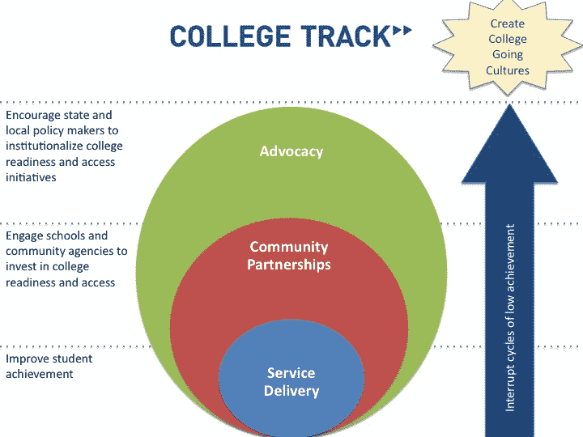

# 为了纪念史蒂夫·乔布斯，Salesforce Foundation 将向 College Track TechCrunch 捐赠 50 万美元

> 原文：<https://web.archive.org/web/http://techcrunch.com/2011/10/11/in-honor-of-steve-jobs-salesforce-foundation-will-match-500k-in-donations-to-college-track/>

# 为了纪念史蒂夫·乔布斯，Salesforce 基金会将向 College Track 捐赠 50 万美元

随着世界各地的人们哀悼史蒂夫·乔布斯的去世，许多人都在寻找方法来表达他如何影响和丰富了他们的生活，无论是通过苹果直观的小工具，皮克斯的明星电影，还是乔布斯鼓舞人心的话语。一个很好的方法是——正如谷歌的 Hunter Walk 所说——在日常生活中像 Steve 一样生活。还有一种方式就是支持他和家人关心的事情。

从今天开始，[sales force 基金会](https://web.archive.org/web/20230203072940/http://foundation.force.com/home)将通过向[大学赛道](https://web.archive.org/web/20230203072940/http://www.collegetrack.org/)捐款来纪念乔布斯，该基金会由史蒂夫·乔布斯的妻子劳伦娜·鲍威尔·乔布斯共同创立。在此 [Causes 页面](https://web.archive.org/web/20230203072940/http://causes.com/honorstevejobs)上捐赠的每一美元，Salesforce 都会再捐赠一美元，最高可达 500，000 美元(因此，总捐赠额为 100 万美元，包括其他所有人的捐赠)。

大学追踪项目致力于帮助弱势青年进入大学(并在大学取得成功)，既通过大学预科考试，也帮助培养一种重视和实现学术成功和高等教育的文化。你可以在这里了解更多关于组织如何运作的信息[。](https://web.archive.org/web/20230203072940/http://www.collegetrack.org/main/content/view/13/129/)

以下是 Salesforce Foundation 在他们的原因页面上包含的注释:

> 史蒂夫·乔布斯是我们行业有史以来最伟大的领导者。他不仅是现代计算机之父；他永远改变了音乐、电影，点燃了移动革命。我们对他所做的一切深表感谢，并对他的去世感到悲痛。
> 
> 为了纪念史蒂夫的一生和他的贡献，Salesforce.com 基金会将向大学跟踪匹配捐款总额高达 50 万美元。由史蒂夫·乔布斯的妻子劳伦娜·鲍威尔·乔布斯共同创办的“大学追踪”是一个致力于确保资源不足的高中生实现大学教育梦想的项目。
> 
> 请尽你所能，向史蒂夫·乔布斯致敬，并帮助那些最需要帮助的学生。

【YouTube = ' http://www . YouTube . com/watch？v=i2CfoY4hjtk']