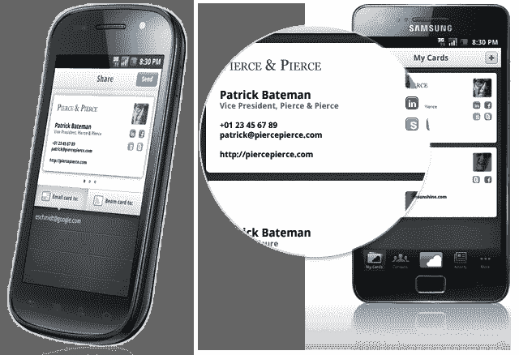

# 在不断寻求消灭纸质名片的过程中，Cardcloud 推出了安卓应用 

> 原文：<https://web.archive.org/web/http://techcrunch.com/2011/09/19/in-ongoing-quest-to-kill-paper-business-cards-cardcloud-launches-android-app/>

# 在正在进行的消灭纸质名片的探索中，Cardcloud 推出了 Android 应用程序

[Cardcloud](https://web.archive.org/web/20230203134341/http://www.crunchbase.com/company/e) ，原名[我叫 E](https://web.archive.org/web/20230203134341/https://techcrunch.com/2009/04/17/my-name-is-e-potentially-cracks-the-e-cards-conundrum/) ，今天终于——T4 发布了一个安卓应用程序。

[Android card cloud](https://web.archive.org/web/20230203134341/http://www.cardcloud.com/android)基本上允许用户创建和交换无限数量的在线名片。

有趣的是，收件人不需要在手机上安装任何应用程序，因为 Cardcloud 用户可以直接将他们的联系方式等发送到电子邮件地址。不用说，这使得 Cardcloud 成为交换传统名片的绝佳选择。

用户可以快速与手机上安装了该应用程序的人共享(发送)他们的卡云卡，该服务可以在不同的平台上运行(在卡云的例子中，这意味着将[苹果手机](https://web.archive.org/web/20230203134341/http://eu.beta.techcrunch.com/2009/07/30/my-name-is-e-releases-iphone-app-to-kill-the-business-card/)移植到安卓手机上，反之亦然是可能的)。

Cardcloud 卡包含通常在纸质名片上找到的联系信息，但也可以包括社交网络账户链接、最新个人资料图片、地理位置信息和笔记。还包括一个 vCard，用于在本地设备或服务上快速存储。

如需其他或类似服务，请查看 [Bump](https://web.archive.org/web/20230203134341/http://bu.mp/) 、 [SnapDat](https://web.archive.org/web/20230203134341/http://snapdat.com/index.html) 、 [CardFlick](https://web.archive.org/web/20230203134341/http://cardflick.co/) 和 [CloudContacts](https://web.archive.org/web/20230203134341/http://www.cloudcontacts.com/) 。

