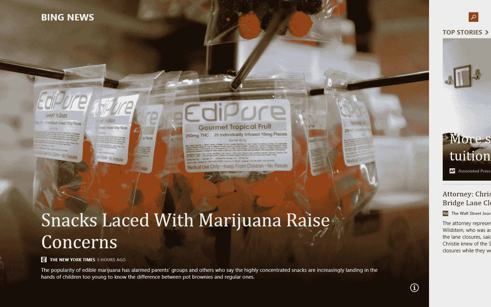

# 赞扬 Metro TechCrunch

> 原文：<https://web.archive.org/web/https://techcrunch.com/2014/02/02/in-praise-of-metro/>

看起来微软终于[意识到【Metro(或者现代用户界面或者其他他们现在称之为的东西)不适合桌面。如果传言属实，今年晚些时候，随着 Windows 8.1 的首次重大更新，Metro 将继续不受重视。毫无疑问，这样做是完全正确的。Metro 实际上是一个很棒的用户界面——只是不是在桌面上。](https://web.archive.org/web/20221206011141/http://verynicewebsite.net/2014/01/an-uncompromising-vision/)

所以让我们看看积极的一面:在平板电脑上，Metro 实际上非常非常好。在 Surface 这样的平板电脑上，这是一个比 iOS 或 Android 更具生产力的界面。在很大程度上，这是因为你可以在屏幕上有不止一个应用程序，这是微软经常在广告中强调的，但只有当你从 Windows 平板电脑切换回 iPad 时，你才会真正体会到这一点。

它苦于缺乏必备的应用程序，微软也从未弄清楚如何在这个平台上获得像样的应用程序。即使在今天——除了游戏——最好的地铁应用实际上来自微软自己。例如，必应新闻是一个非常好的新闻阅读器。微软的 finance app 也很不错，SkyDrive/OneDrive、Xbox Music、Bing 天气、Bing 地图(尤其是最新的预览版)也很不错。活瓷砖是个好主意。甚至 Metro 中的 Internet Explorer 也被证明是一个快速、触摸优先的浏览器。

然而，这些应用程序显示了一个与其竞争对手截然不同的平台的潜力(这可能正是其失败的原因)。微软愿意赌一把，创造了一个现代的、高度可用的用户界面，有时会让竞争对手看起来比设计曲线落后几年。

Metro 使用了一些不太直观的触摸手势。谁会想到从左边滑进去，再从右边滑回来打开你最近用过的应用呢？从右边滑入，调出你的“护身符”和设置？不过，一旦你习惯了它的怪癖，一切都会好的。

然而，如果失败了，我敢肯定，未来我们将会看到大量关于 Windows 8 的商学院论文。

Instapaper 创始人 Marco Arment [认为](https://web.archive.org/web/20221206011141/http://verynicewebsite.net/2014/01/an-uncompromising-vision/)Windows 8——尤其是 Metro 失败了，因为“微软不是苹果，微软的客户也不是苹果的客户。”在他看来，微软的客户还没有为这种彻底的变化做好准备，该公司忘记了谁是它的客户。

这有一定的道理，但我的感觉是，微软的主要错误只是将旧的桌面和新的基于磁贴的界面强制整合到一个操作系统中。就像苹果一样，微软明白触摸界面必须不同于常规的桌面界面。但它并没有仅仅为平板电脑打造一个 Windows(最好名字中完全不包含“Windows”以避免混淆)和一个更好的 Windows 7，而是必须把它们都塞进一个。

在某种程度上，Windows RT 应该是平板电脑的 Windows，但即使是这样，它也有内置的桌面，所以人们可以运行 Office。但是 RT 只是把人搞糊涂了。如果微软允许自己放开对 Office 的迷恋，它可能有更好的机会让 RT 成功。

Metro 很棒，但微软认为人们会很快在台式机和笔记本电脑上采用触摸，这显然是错误的。也许这仍然会发生，但是现在，它通过隐藏尽可能多的 Metro 界面为用户做了正确的事情。