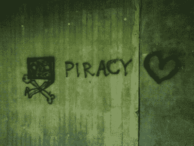

# 赞扬盗版 TechCrunch

> 原文：<https://web.archive.org/web/http://techcrunch.com/2011/02/05/in-praise-of-piracy/>

最近，我不得不思考很多关于数字版权管理(T2)的事情。不是我想。但我最近为一个大量使用数字版权管理的媒体应用程序做了一些令人大开眼界的合同软件开发，就在此时，我们在北美的政府出台了一项新的[非常有利于数字版权管理的](https://web.archive.org/web/20230203042630/http://www.michaelgeist.ca/content/view/5316/125/)版权法，并且[不要让我偷](https://web.archive.org/web/20230203042630/http://www.dontmakemesteal.com/)的链接开始在互联网上到处出现。

除非你真的从事一个充斥着 DRM 的软件项目，否则你可能意识不到其中付出了多少徒劳的努力。我估计，开发人员花在这个应用上的时间有四分之一都花在了构建或处理 DRM 上，也就是说，有四分之一的时间没有花在打造一个杀手级应用上。类似地，索尼在[CD rootkit](https://web.archive.org/web/20230203042630/http://en.wikipedia.org/wiki/Sony_BMG_copy_protection_rootkit_scandal)和[令人印象深刻的 PS3 加密](https://web.archive.org/web/20230203042630/http://www.bbc.co.uk/news/technology-12116051)上花费的无数时间和金钱并没有用于构建更好的产品。所有这些浪费在限制而不是创造上的努力让我想起了伟大的雷沙德·卡普契斯基对苏联经济的描述:

> 人们可以假设苏联冶金工业的很大一部分都致力于生产带刺铁丝网……因为这件事不会随着边界的布线而结束！在古拉格群岛，有多少千米长的铁丝网用于围栏？……如果把所有这一切乘以苏联政府存在的年数，就很容易理解为什么在斯摩棱斯克或鄂木斯克的商店里，人们既买不到锄头也买不到锤子，更不用说刀子或勺子了:这种东西根本无法生产，因为必要的原材料在制造带刺铁丝网时已经用完了。

DRM 是媒体世界的铁丝网。没有人喜欢它，除了制造商、出版商、制片人和版权所有者……包括，呃，我在内的一群人。我一直很固执，也很幸运，在世界各地出版了一批小说——不可避免地，还有盗版。作为一名“内容制作者”，我通常被期望(尤其是我的出版商)成为 DRM 的坚定支持者，也是盗版的死敌。

很容易看出为什么。大多数在网络上回响的支持无限制复制的论点从“智力懒惰”到“故意欺骗”。是的，音乐人用演出收入弥补了大部分盗版损失，但不，同样的情况不可能出现在所有其他行业。是的，科利·多克托罗做得很好，但他是一个极端的局外人，他在世界上最受欢迎的博客之一上推销自己，并与马克·舒托沃尔斯共进了[1 万美元的午餐。不，“真正的艺术家”不会坚持下去，不管他们是否得到报酬；激情与天赋只是松散地联系在一起，那些全职工作的人比业余爱好者做得更多更好。是的，默默无闻是任何创作者的首要敌人，但这并不能让盗版成为朋友。不，海盗湾不只是像一个图书馆或二手商店。是的，所有这些论点听起来就像“我想要你多年努力的成果，但我不想以任何有意义的方式奖励你！”包裹在极薄的合理化。](https://web.archive.org/web/20230203042630/http://www.publishersweekly.com/pw/by-topic/columns-and-blogs/cory-doctorow/article/15883-doctorow-s-project-with-a-little-help.html)

虽然这么说让我很痛苦，但海盗们站在了历史的正确一边。建立在铁丝网上的帝国不可避免地会崩溃，而且越快越好；当这个政权掌权时，它延续了过去的政权，压制了创新和进步。盗版有错吗？是的，但是那是错误的问题。正确的问题是，哪一个更糟糕:普遍的盗版，还是无休止的徒劳地试图在各地保留 DRM？海盗万岁。那些混蛋。请不要让我再说一遍。

讽刺的是，给我希望的是苹果。是的，苹果，不像亚马逊，拒绝出售无数字版权管理的电子书。但是当我知道人们已经从 iTunes 上购买了数十亿首歌曲(这是一个笨拙、恼人的工具，提供了迄今为止苹果整个产品套件中最糟糕的用户体验)时，我受到鼓舞，尽管他们可以很容易地免费下载这些歌曲。大多数人都不想偷。如果我们这些内容生产者让我们的商品足够便宜，过程足够简单，他们就会愿意购买。我希望如此。因此，我已经在知识共享许可下发布了我的[的两本](https://web.archive.org/web/20230203042630/http://www.feedbooks.com/userbook/14338)书，并且我正试图说服同意重新发布第三本书的主要出版商不使用任何数字版权管理。到目前为止，他们并不情愿:但这是一个信念的飞跃，今天所有 DRM 的捍卫者最终都必须做出这个决定。

*图片来源:Thobias Vemmenby/[Flickr](https://web.archive.org/web/20230203042630/http://www.flickr.com/photos/toobydoo/2476286356/)*