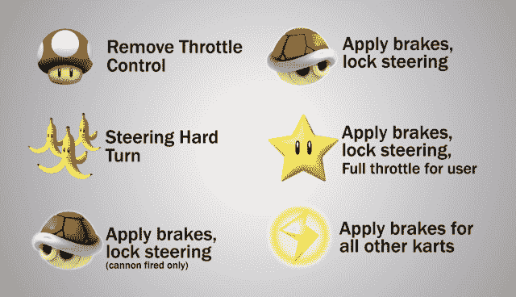
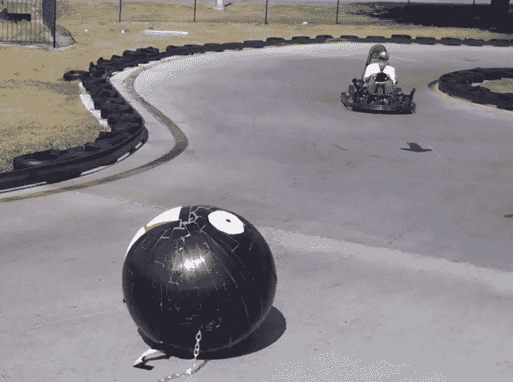

# 在现实生活中的马里奥赛车，“我会赢的！”TechCrunch

> 原文：<https://web.archive.org/web/https://techcrunch.com/2013/01/14/in-real-life-mario-kart-im-a-gonna-win/>

# 在现实生活中的马里奥赛车，“我会赢的！”

【YouTube http://www.youtube.com/watch?v=w1Iat_WmvrI&w=640&h=360]

“我希望你能在现实生活中玩这个游戏。”

几乎所有玩过《马里奥赛车》游戏的人都嘀咕过这句话——如果你在过去几十年里玩过电子游戏，那么你很可能至少会遇到这款经典游戏中的一款。

嗯，滑铁卢实验室国家仪器公司的人刚刚回应了两代赛车、投掷炮弹、收集神秘盒子的马里奥赛车迷的祈祷。他们开发了[系统](https://web.archive.org/web/20230331002434/http://www.youtube.com/watch?feature=player_embedded&v=w1Iat_WmvrI)，该系统使用各种电动机、微处理器和 RFID 标签，将视频游戏的相同玩法带到现实生活中。

是的，与真正的卡丁车，明星，贝壳，和轨道障碍。看在上帝的份上，即使是嚼链子。

我想我可能会哭。

用户在真正的卡丁车赛道上比赛，只是这些卡丁车配备了加固的微处理器、压力系统(向人们发射炮弹)和伺服电机。伺服电机的工作方式与任何电机一样，只是它们带有一个电位计。

这意味着，加上微处理器，卡丁车知道它何时碾过香蕉皮或收集到一颗星星，并做出相应的反应(在前者的情况下，或者在后者的情况下，开得更快一点)。

滑铁卢实验室的人说，他们没有计划将课程商业化，但“所有的设计和代码都是可用的，WLL 会很高兴帮助别人建立一个这样的系统。”

