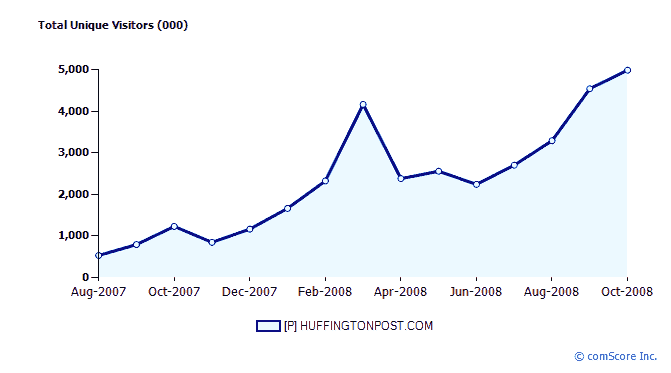

# 在选举的余晖中,《赫芬顿邮报》希望筹集 1500 万美元 TechCrunch

> 原文：<https://web.archive.org/web/https://techcrunch.com/2008/11/21/in-the-afterglow-of-the-election-huffpo-looks-to-raise-15-million/>

# 在选举的余晖中,《赫芬顿邮报》希望筹集 1500 万美元

选举对政治超级博客[赫芬顿邮报](https://web.archive.org/web/20221007201200/http://www.huffingtonpost.com/)有利。根据 comScore 的数据，去年 10 月份，它在美国的观众人数增长了五倍，达到每月 500 万人。《泰晤士报》英国版[报道](https://web.archive.org/web/20221007201200/http://business.timesonline.co.uk/tol/business/movers_and_shakers/article5201252.ece)该公司即将融资 1500 万美元，这可能是一个绝佳的市场时机。过去，它已经从包括软银资本、Greycroft Partners、Bob Pittman 和 Ken Lerer 在内的投资者那里筹集了总计 1200 万美元的资金。

和所有政治网站一样，随着选举热的结束,《赫芬顿邮报》的流量可能会下降。不过，投资者面临的问题是，目前的水平是否代表着一个峰值，或者，它是否能利用新发现的受众，建立一个稳固的新交通平台，并在此基础上保持增长。如果你看看谷歌趋势的[《赫芬顿邮报》图表](https://web.archive.org/web/20221007201200/http://trends.google.com/websites?q=huffingtonpost.com&geo=all&date=all&sort=0)(见上图),正如你所料，11 月份的流量至少处于停滞状态。

它从这里去哪里？

