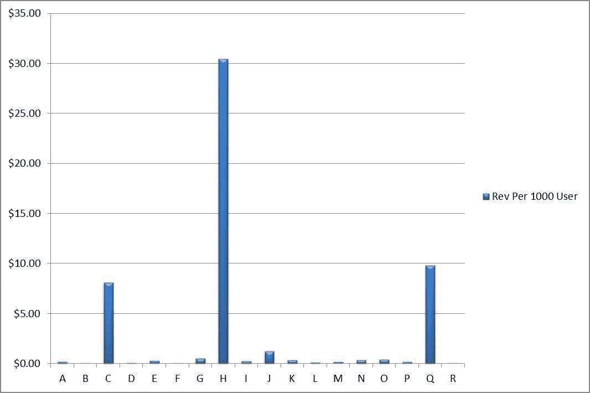
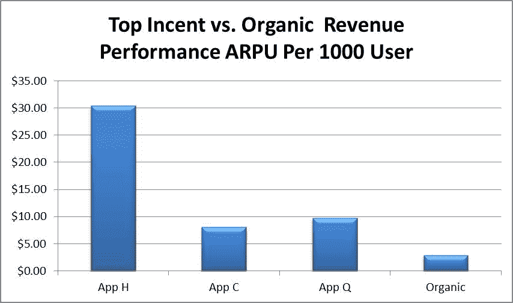

# 新研究称，激励性安装并不都是坏事...但是考虑一下来源 

> 原文：<https://web.archive.org/web/http://techcrunch.com/2011/09/07/incentivized-installs-not-all-bad-says-new-study-but-consider-the-source/>

根据一项新的研究，如果管理得当，通过“激励性”安装获得的移动用户可能是有价值的。该术语指的是下载移动应用程序以换取其他东西的用户——通常是游戏中的虚拟货币或商品。传统上，这类用户被认为是可以随意处置的，只是作为提升应用在 iTunes 中排名的一种方式……至少在[苹果打击现在被禁止的做法](https://web.archive.org/web/20230204223720/https://techcrunch.com/2011/04/19/apple-clamps-down-on-incentivized-app-downloads/)之前是这样。

但一项关于移动应用流量的新研究显示，在某些情况下，激励性流量可以胜过有机流量。不幸的是，鉴于该报告的来源，它仍然给我们留下了相当多的疑问。

这项研究是由 [W3i](https://web.archive.org/web/20230204223720/http://www.w3i.com/) 进行的，这是一个应用分发和货币化网络。而 W3i 从事的是什么？是的，[奖励安装](https://web.archive.org/web/20230204223720/http://www.w3i.com/mobile-apps-publishers.aspx)。嗯，算是吧。鉴于苹果的禁令，W3i 现在专注于通过其[移动广告平台](https://web.archive.org/web/20230204223720/http://www.w3i.com/maapbeta/)推广免费应用。这是一种更友好、更温和的鼓励安装的方式，与其最初的激励安装计划截然不同。

也就是说，宣称 W3i 不能通过宣传激励安装的好处而获得好处是幼稚的。

但是我们来看数据。

在 2010 年 12 月至 2011 年 4 月期间，W3i 研究了一个流行游戏的突发活动的每个流量源的 30 天保留率。它还计算了每个流量来源的流量(见下图，每种颜色代表一个不同的应用)。

付费量最高的来源(77，541 次安装)产生了第二好的 30 天保留率(6.22%)。但是第二大卷源(64，497 次安装)表现最差(2.16%)。

[")](https://web.archive.org/web/20230204223720/https://techcrunch.com/wp-content/uploads/2011/09/volumevsretention_w3i-2.png)

为什么不同？

两者都是激励性的流量来源，但两者的留存率却大相径庭。显然，不是每个流量来源都是一样的。在这种情况下，流量来源是推广游戏的单个应用程序。一个应用程序在一个月后比另一个应用程序的留存率更高。

收入也出现了类似的趋势。(字母指的是应用程序，其名称无法列出)。

此外，就 ARPU(每用户平均收入)而言，甚至存在有机流量表现不如激励流量的情况。

不幸的是，虽然这个(太窄了)数据似乎表明，激励安装并不一定是苹果在所有情况下都表现出来的怪物，但这些数据的来源是可疑的。从一个不那么偏见的公司看到一个更广泛的研究将是有趣的。

与此同时，从这些发现中得到的最大收获是，如果实施正确，激励性安装实际上可以为一些人带来有价值的新用户。但是这种情况有多常见呢？在哪些应用中？这里的大趋势是什么？这些发现是偶然的还是意料之中的？这些都是 W3i 在这项研究中没有回答的问题，而是展示了单个游戏的趋势。我们会说，还不足以证明苹果是错的。