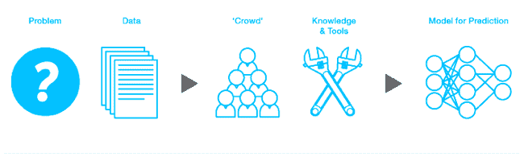
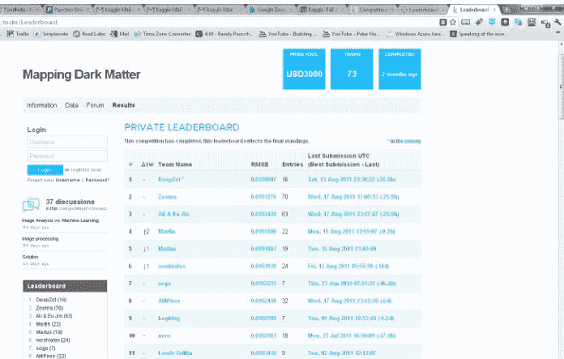

# Index 和 Khosla 在数据建模竞赛平台 Kaggle 中以 1100 万美元领先 

> 原文：<https://web.archive.org/web/http://techcrunch.com/2011/11/02/index-and-khosla-lead-11m-round-in-kaggle-a-platform-for-data-modeling-competitions/>

[Kaggle，](https://web.archive.org/web/20230203153655/http://www.kaggle.com/)预测数据建模竞赛平台，在由 Index Ventures 和 Khosla Ventures 领投的 A 轮融资中获得了 1100 万美元。SV Angel，尤里·米尔纳的 Start 基金，投资管理斯坦福大学捐赠基金和其他金融资产的斯坦福管理公司，PayPal 创始人麦克斯·拉夫琴；谷歌首席经济学家哈尔·瓦里安；以及 Applied Semantics 的联合创始人兼首席执行官吉尔·埃尔巴兹(Gil Elbaz)也参与了这一轮投资。Index Ventures 的合伙人尼尔·里默(Neil Rimer)将加入 Kaggle 的董事会，莱佛青已被任命为公司董事长。

Kaggle 的预测建模竞赛平台帮助公司、政府和研究人员确定一些世界上最困难的数据问题的解决方案，方法是将它们作为竞赛发布给世界各地超过 17，000 名博士级数据科学家的社区。

Kaggle 数据科学家社区由数千名来自计算机科学、统计学、计量经济学、数学和物理等定量领域的博士组成。他们来自 100 多个国家和 200 所大学。除了奖金和数据，他们还利用 Kaggle 与相关领域的专家会面、交流和合作。正如 Kaggle 创始人安东尼·戈德布卢姆告诉我的那样，“我们正在把大数据科学变成一项运动。”

它是这样工作的。公司和组织可以将大型数据集发布到平台上，并要求科学家从数据中解决问题。参与 Kaggle 竞赛的数千名数据科学家随后开发算法来解决这些大规模问题，并在每次竞赛中提交其算法的迭代。

Kaggle 实际上维护着每场比赛排名的实时排行榜，因此竞争对手有动力超越当前的基准，直到比赛结束。一旦比赛结束，赞助组织会有一个解决方案，该领域的顶尖参赛者会将比赛奖金带回家。到目前为止，来自世界各地的数据科学家已经向各种 Kaggle 比赛提交了近 47，000 份参赛作品。

Kaggle 说，这些结果实际上导致了许多行业的新数据发现和突破。例如，美国国家航空航天局(NASA)、皇家天文学会(Royal Astronomical Society)和欧洲航天局(European Space Agency)的一项竞赛确定了绘制宇宙暗物质地图的新方法，而另一项竞赛有助于更好地确定艾滋病患者健康状况改善或恶化的可能性。

保险公司好事达(Allstate)展示了另一个例子，该公司开展了一项索赔预测挑战，希望从用户子集中确定哪些机动车辆更有可能发生车祸。好事达公司提供了该公司投保汽车的两年数据，供科学家运行。

Kaggle 目前正在主办 300 万美元的遗产健康奖，这是有史以来最大的医学奖，旨在帮助减少数十亿美元的不必要的住院费用。

谷歌的瓦里安是这样评价 Kaggle 的:“Kaggle 是一种组织世界上最有才华的数据科学家的智慧的方式，并使其能够为各种规模的组织所用。通过构建激励机制来创造竞争环境，Kaggle 推动数据科学家产生比他们单独工作时更好的结果。”

当然，许多公司和企业可能不希望将机密和敏感数据上传到公共平台。Kaggle 为处理敏感数据或知识产权的组织提供私人竞赛。在私人竞赛中，数据与精心挑选的一组 Kaggle 科学家共享，这些科学家遵守保密协议，接受背景调查，并且在以前的 Kaggle 竞赛中表现优异。每一个参加比赛的参赛者都会根据他或她的表现获得奖金。

Khosla Ventures 创始人兼合伙人维诺德·科斯拉表示:“Kaggle 正在致力于大数据分析领域最令人兴奋的机会之一，这是我在过去二十年中所见过的。" Kaggle 的平台有潜力改变我们处理数据分析问题的方式."

Kaggle 表示，新的资金将用于招聘(该公司目前只有一名开发人员)以及销售和营销工作。

