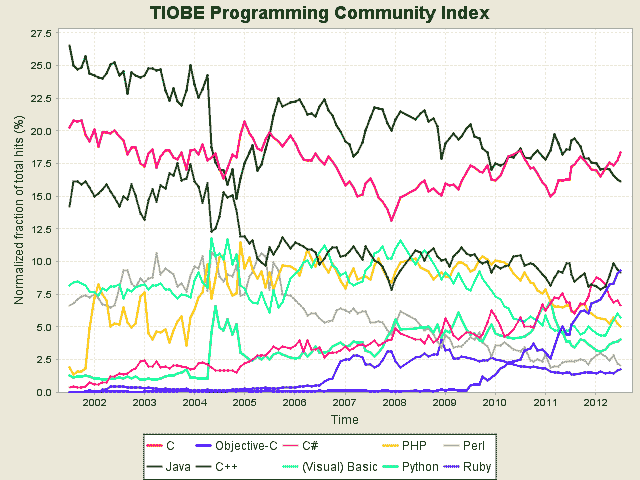

# 索引显示，随着移动开发的繁荣，iOS 编程语言现在位居前三 

> 原文：<https://web.archive.org/web/https://techcrunch.com/2012/07/05/index-shows-ios-programming-language-now-in-top-3-as-mobile-development-booms/>

# 索引显示，随着移动开发的繁荣，iOS 编程语言现在排名前三

根据 TIOBE 指数(T1)， [Objective-C](https://web.archive.org/web/20221215092954/http://en.wikipedia.org/wiki/Objective-C) 现在比 [C++](https://web.archive.org/web/20221215092954/http://en.wikipedia.org/wiki/C%2B%2B) 更受欢迎，这证明了当我们进入后 PC 时代时，移动开发正在迅猛发展。

Objective-C 是面向对象的编程语言，开发者用于 iOS。它开始于 1983 年，同年 C++被创造出来。多年来，C++被证明更受欢迎。但是在 1988 年，史蒂夫·乔布斯改变了 Objective-C 未来的发展方向，他将它授权给下一个[版本](https://web.archive.org/web/20221215092954/http://en.wikipedia.org/wiki/NeXT)。在 2009 年之前，它的市场份额还不到 1%，这主要归功于 iPhone 和 iPad，当时 iOS 的发展才真正开始起飞。

正如 TIOBE index 所显示的，这两种编程语言实际上不再竞争激烈。C++主要用于大型高性能系统，而 Objective-C 主要用于移动应用行业。

同样值得注意的是:Java 编程语言掉到了第二的位置。与去年同期相比，得益于 Java 3.16%的下降，它与 C 语言交换了位置。

TIOBE 提供每月索引。据该网站称，“评级基于全球熟练工程师、课程和第三方供应商的数量。流行的搜索引擎谷歌，必应，雅虎！、维基百科、亚马逊、YouTube 和百度来计算评分。”

下面我们来看看这两种编程语言是如何比较的。

这个排名应该被看作是关于编程语言市场状况的轶事。例如，这个排名与斯蒂芬·奥格雷迪二月份在红和尚博客上发布的大相径庭。他的客观排名是第 12 位。

排名的不同很大程度上是由于各自使用的标准。RedMonk 对编程语言进行了分层，并比较了来自 GitHub、Stack Overflow 和 LinkedIn 等社区的数据，而正如前面提到的，TIOBE 主要关注搜索引擎。

排名提供了整体企业应用程序开发状态的背景。与 Objective-C 和其他语言相比，Java——企业长期以来最喜欢的语言——可能正显示出其受欢迎程度下降的迹象。

看看奥格雷迪的发现，你可以收集到另一个故事。他的结果显示了编程语言领域的裂痕。它们反映了供应商如何改变他们对支持何种语言的看法。Java 和微软不再是唯一的软件栈。供应商需要考虑许多选择。他解释说，这就是为什么像 [Cloud Foundry](https://web.archive.org/web/20221215092954/http://cloudfoundry.org/) 和 [OpenShift](https://web.archive.org/web/20221215092954/https://openshift.redhat.com/app/) 这样的平台即服务(PaaS)栈在推出时就因支持多种编程语言而与众不同。

企业供应商的未来将更像 CloudFoundry 和 OpenShift 正在做的事情。但增长的整体驱动力将是开发者开发的应用。在这方面，我预计随着移动市场的持续繁荣，Objective-C 将在整个企业环境中继续流行。