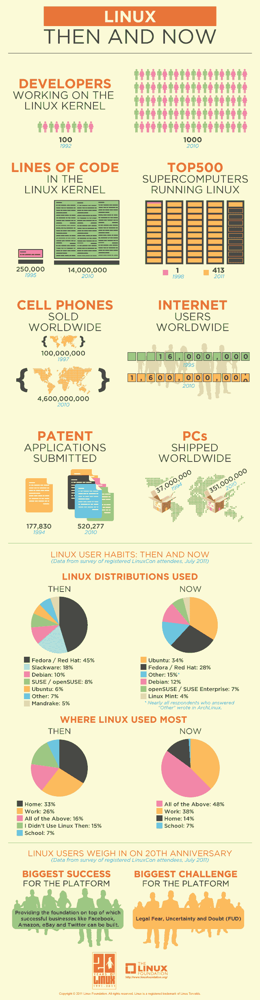

# 信息图:Linux 的过去和现在 TechCrunch

> 原文：<https://web.archive.org/web/http://techcrunch.com/2011/08/17/infographic-linux-then-and-now/>

# 信息图:Linux 的过去和现在

继昨天的[Linux 20 年](https://web.archive.org/web/20230205011018/https://techcrunch.com/2011/08/15/jim-zemlin-on-20-years-of-liunx/)之后， [Linux 基金会](https://web.archive.org/web/20230205011018/http://www.linuxfoundation.org/)今天发布了一张信息图，强调了 Linux 和更大的计算机行业在过去二十年中的一些显著变化。Linux 内核在 1995 年有 250，000 行代码，但是在 2010 年有 14 *百万*行代码。今天，Linux 用户越来越多地在家里和工作中使用它，而不仅仅是在家里用于个人目的。

LinuxCon 今天正式启动，我将会见来自 Linux 生态系统的许多人，从 Red Hat 首席执行官吉姆·怀特赫斯特到 Canonical 的 Allison Randal 到 Wind River Linux 的 Nithya Ruff。如果你有任何问题想问这些人，请在评论中留下，我会尽力而为。

